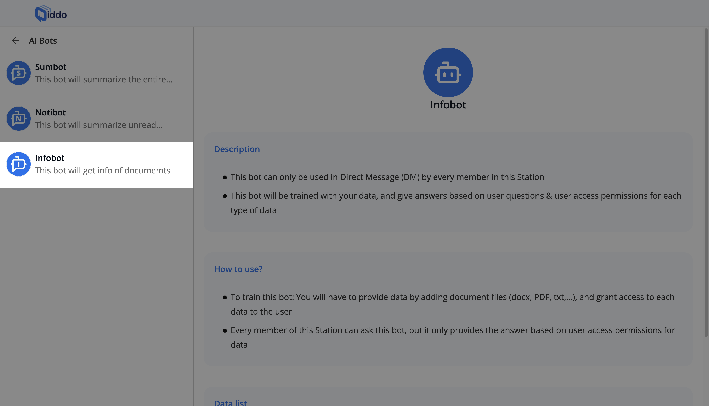
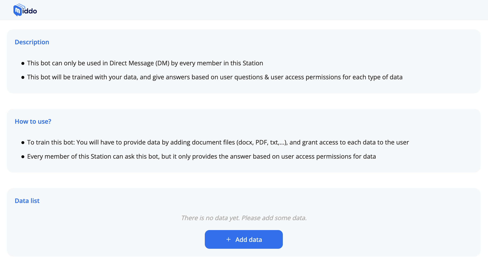
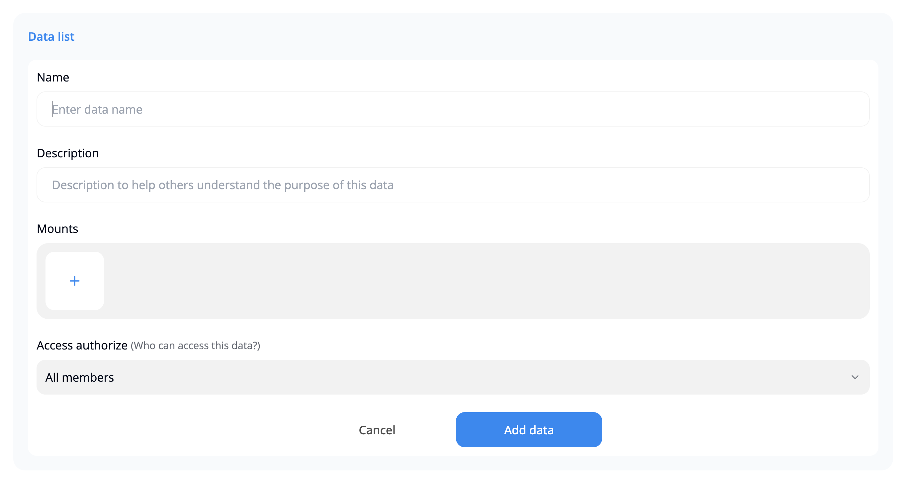
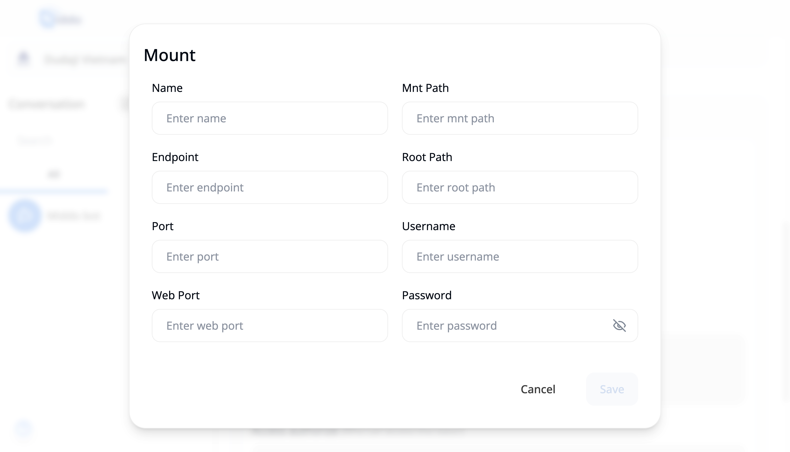
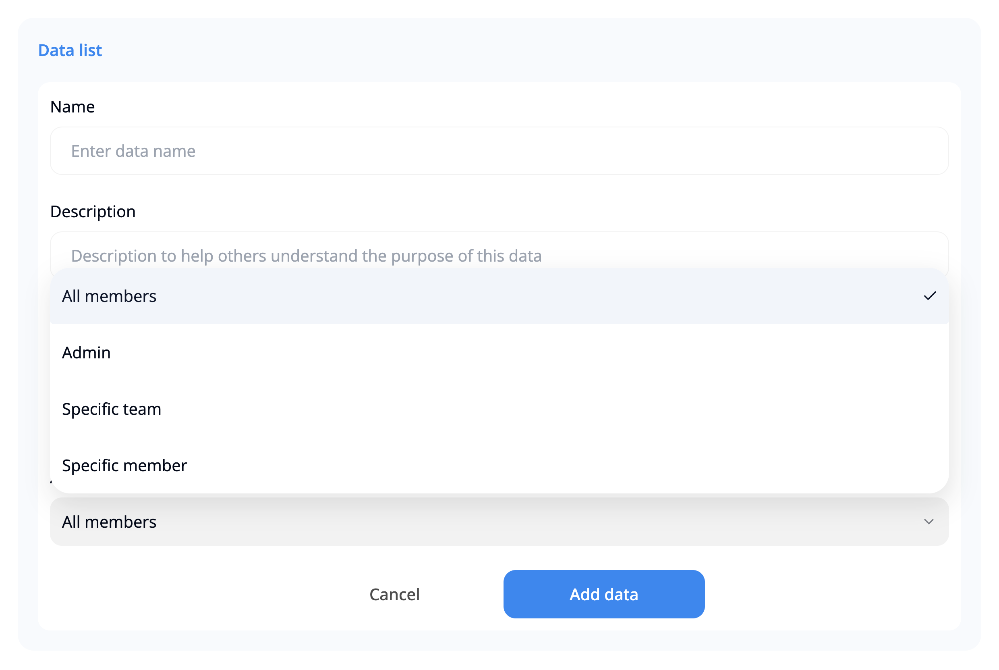

# Setup Infobot

Infobot is a powerful AI assistant that can answer questions based on the data you provide. Here's how to set it up:

### **1. Access the AI Bots Section**

Open your Middo Station and go to the **Station settings** section    

Select **AI Bots** from the left-hand menu

### **2. Choose Infobot**

From the list of available bots, select **Infobot**  

### **3. Add Data**

Infobot needs data to answer questions accurately. Click the **+ Add data** button to add data  

Type simple information for your data:
- **Name:** Give your data a clear and concise name
- **Description:** Briefly explain what the data is about and how it can be used

This will help you and your team members easily identify and understand the purpose of each data set

### **4 Configure Mounts**

Click on the **Mounts** section. Then enter the following information:
- **Name:** A descriptive name for the mount
- **Mnt Path:** The path to the mount on your system
- **Endpoint:** The endpoint of the service or data source
- **Root Path:** The root path of the data source
- **Port:** The port number for the service or data source
- **Username:** The username for accessing the service or data source
- **Web Port:** The port number for the web interface of the service or data source
- **Password:** The password for accessing the service or data source

### **5. Configure Access Permissions**

You can adjust access permissions for each data type, deciding who can view and access it  

### **6. Use Infobot**

Once Infobot is trained with data, you can use it in conversations  

Any member of the Station can ask Infobot questions, but it will only answer based on the user's access permissions for the data

:::info **Important Notes:**

- Infobot learns from the data you provide
Access permissions determine who can view and access data  
- Infobot's answers are based on the user's access permissions for the data  
:::

By following these steps, you can create a helpful Infobot within your Middo Station to provide information and support to your team