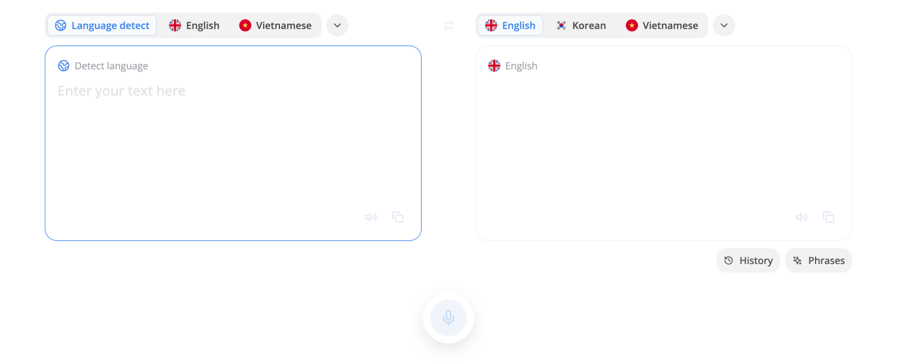

# Dịch thuật là gì

- Middo cung cấp phương pháp dịch ESL để đảm bảo dịch chính xác cao
- E.S.L là viết tắt của "English as a Second Language" (Tiếng Anh là ngôn ngữ thứ hai). Đây là thuật ngữ dùng để chỉ việc học tiếng Anh cho những người có ngôn ngữ mẹ đẻ khác

**Tính năng dịch thuật của Middo**

- Hỗ trợ hơn 100 ngôn ngữ
- Hỗ trợ đầu vào bằng giọng nói
- Hơn 100+ câu ví dụ cho mọi tình huống
- Lưu và chia sẻ bản dịch của bạn một cách dễ dàng

