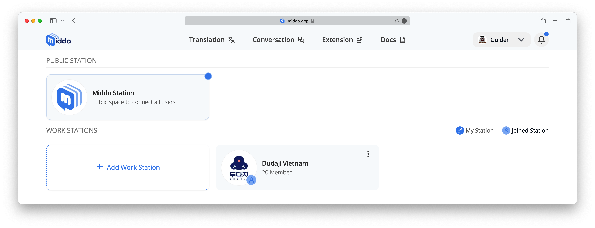

---  
sidebar_position: 2  
hide_table_of_contents: true  
custom_edit_url: null  
pagination_next: null  
pagination_prev: null  
title: Create Your Station  
---  
  
# Create Your Station  
  
  
  
A Middo Station is your dedicated workspace for your team, where you can organize conversations, calls, and other activities. Think of it as a central hub for your team's projects and discussions, designed to enhance communication, collaboration, and overall productivity  
  
## Why Create a Station?  
  
- **Organize your team's work:** Keep all your team's projects, discussions, and files in one place  
- **Improve collaboration:** Make it easier for your team to communicate and work together  
- **Boost productivity:** Streamline your workflow and get more done  
- **Automate tasks:** Utilize powerful bots to automate tasks and streamline your workflow  
- **Break down language barriers:** Use Middo's integrated translation feature for seamless communication across diverse teams  
  
## How to Create a Station  
  
For detailed instructions on creating a Station, refer to the [Create new station](/station/how-to-use-station/create-new-station) guide  
  
## Key Features of a Station  
  
- **Channels:** Create channels within your Station to organize conversations and discussions around specific topics  
- **Members:** Invite team members to your Station to collaborate on projects  
- **Files:** Share and access files related to your team's work  
- **Calendar:** Schedule meetings and events for your team  
- **Tasks:** Assign and track tasks for your team  
- **Bots:** Enhance your Station's functionality with powerful bots:  
  - **SumBot:** Summarize long conversations and extract key information  
  - **NotiBot:** Send notifications to team members about important updates and events  
  - **InfoBot:** Provide quick access to information and resources  
  
## Get Started Now  
  
Ready to create your first Station? Head over to the [Create new station](/station/how-to-use-station/create-new-station) guide for a step-by-step walkthrough  
