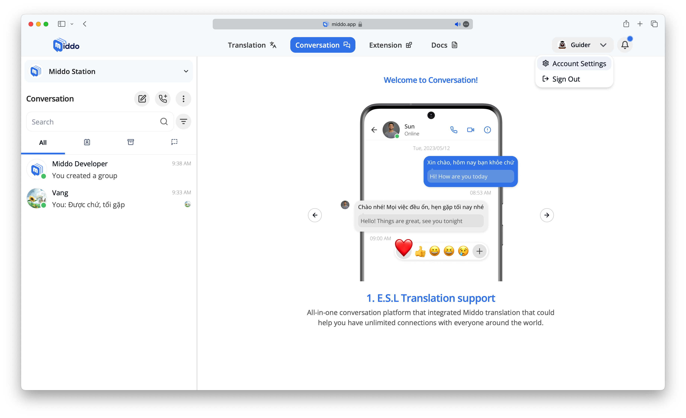
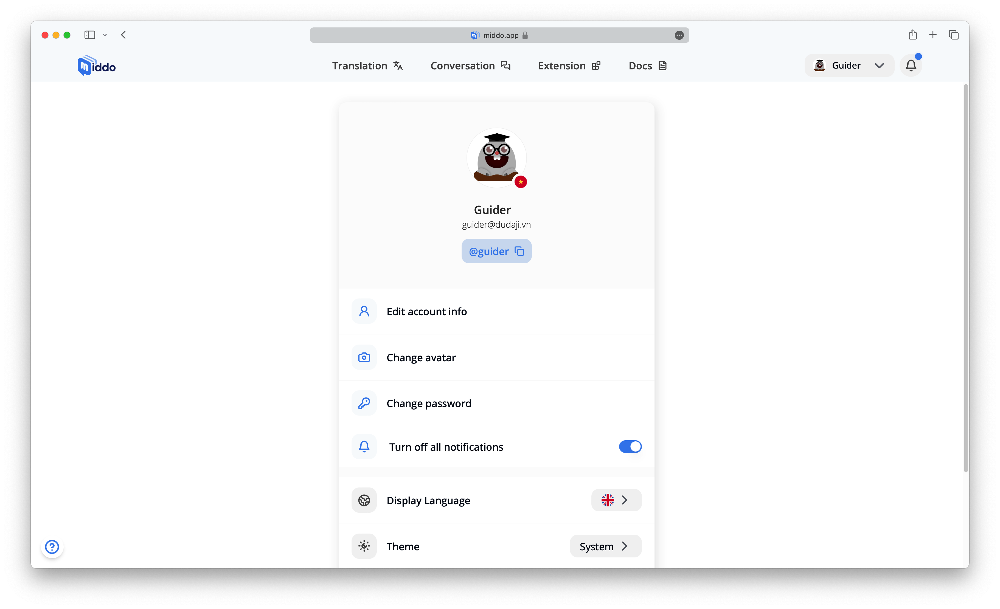
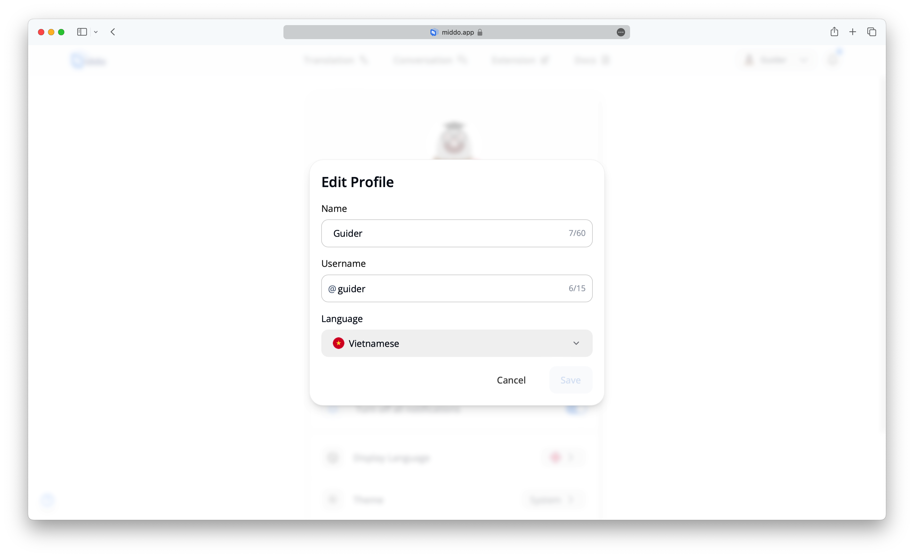
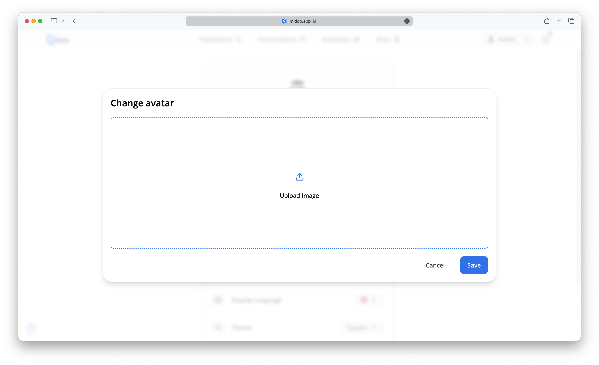
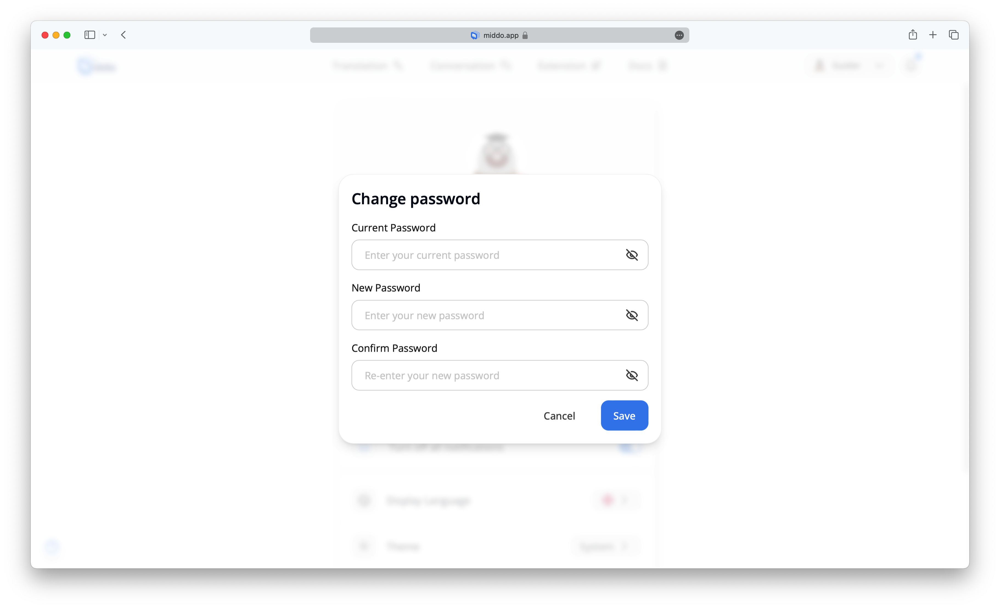
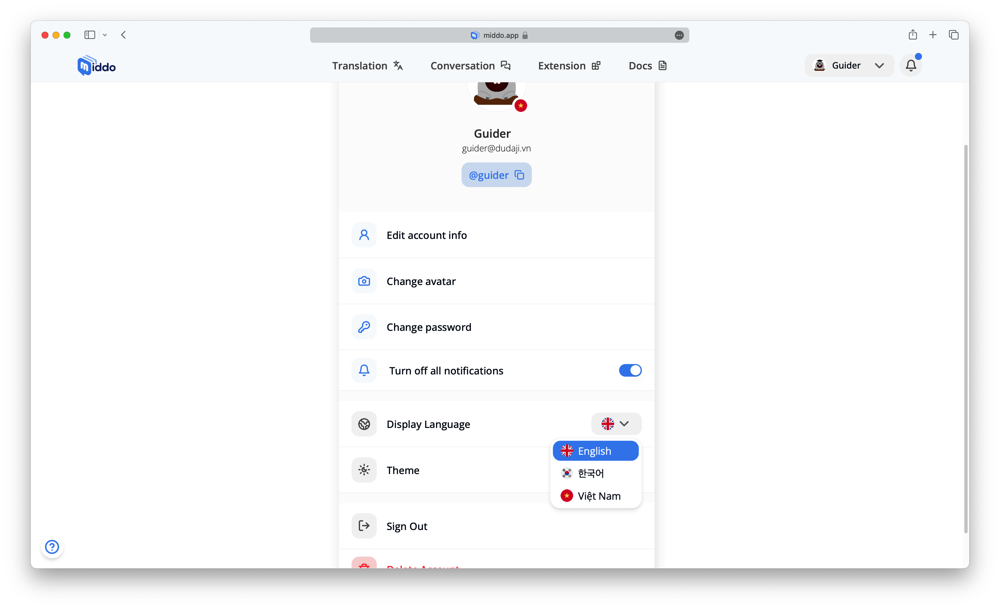
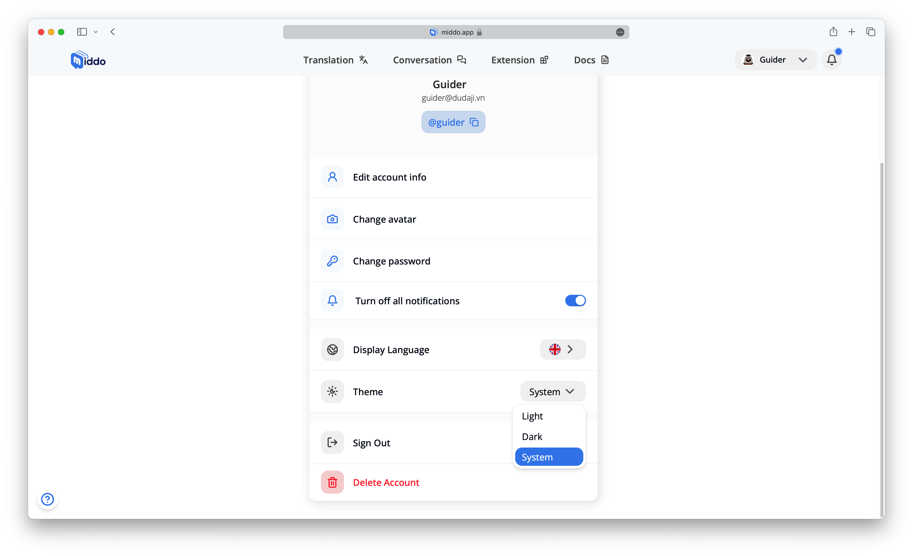
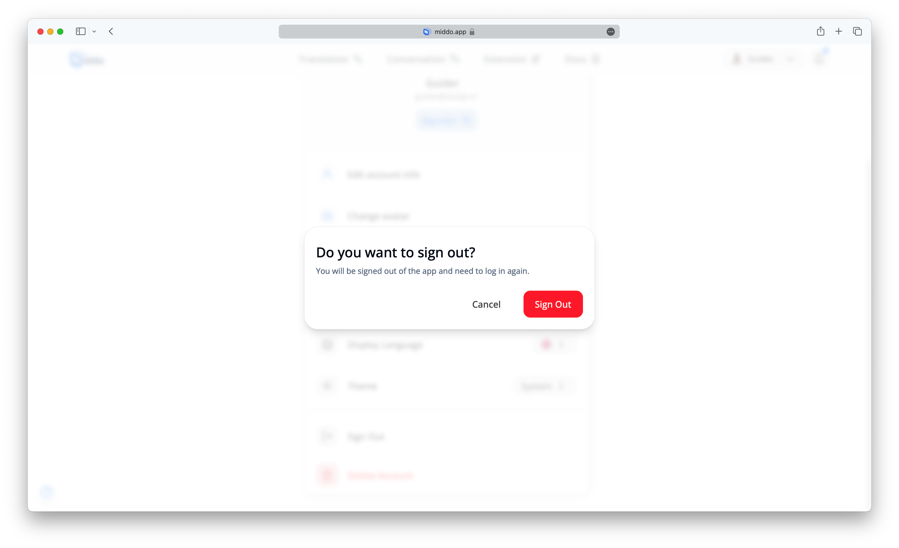
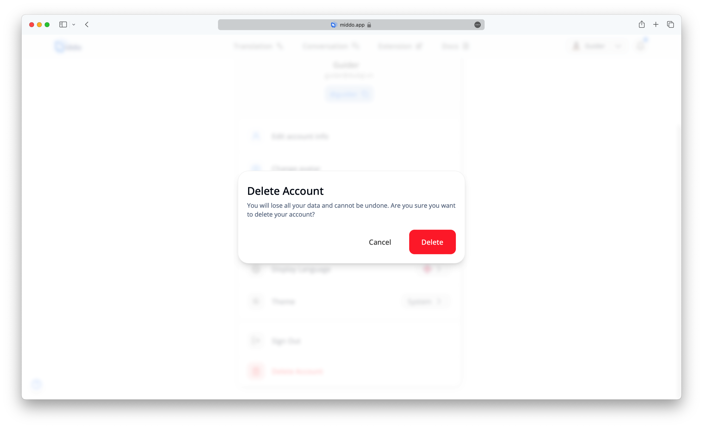

---  
sidebar_position: 4  
hide_table_of_contents: true  
custom_edit_url: null  
pagination_next: null  
pagination_prev: null  
title: Manage Your Account  
---  
  
# Manage Your Account  
  
Oversee your account settings and personalize your experience on Middo.app  
  
To access your account settings, click on your profile picture in the top right corner of the screen and select "Account Settings"  
  
  
### Edit Your Profile  
  
Update your display name, username, and preferred translation language. Customize your profile and tailor your communication preferences to suit your needs  
  
  
### Profile Picture  
  
Upload or change your profile picture to give your account a personal touch and enhance how you're represented to others  
  
  
### Password  
  
Change your password for improved security. Protect your account with a strong, unique password to ensure your personal information remains safe  
  
:::info  
Your password must be at least **8 characters** long and contain at least **1 uppercase** letter, **1 lowercase** letter, and **1 number**!  
:::  
  
### Theme  
  
Choose a theme that matches your style. Personalize the appearance of Middo.app by selecting the color scheme that best fits your preferences  
  
  
### Language  
  
Select the interface language for Middo.app. Choose the language you feel most comfortable using for a smoother experience  
  
  
### Log Out  
  
End your session by securely logging out of your account. Use this when you're finished or switching devices to ensure your account remains secure  
  
  
### Delete Account  
  
Permanently delete your account if you no longer need it. This action will remove all your data and cannot be undone  
  
