---  
sidebar_position: 3  
hide_table_of_contents: true  
custom_edit_url: null  
pagination_next: null  
pagination_prev: null  
title: Start Communicating  
---  
  
# Start Communicating  
  
Middo.app is your hub for connecting and collaborating with your team. Here's how to get started:  
  
### 1. Direct Messaging  
  
**View message list**  
The list of your conversations will appear on the left side of the screen. Click on a conversation to view the details. If there are no conversations, click the **New Conversation** button to start one  
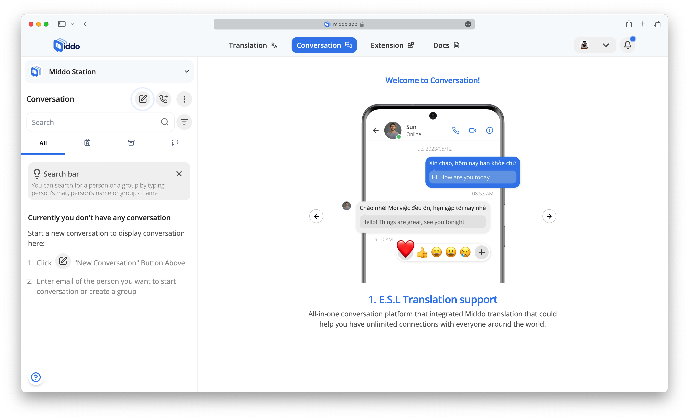  
**Search for a user**  
You can search for a user by entering their name, username, or email  
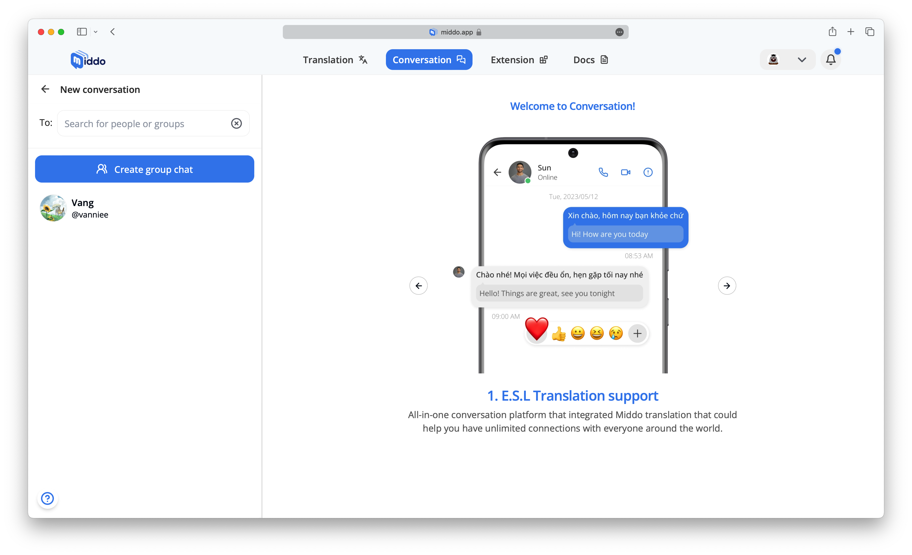  
  
**Start a conversation**  
Once you find the user, click on their name to begin a private chat  
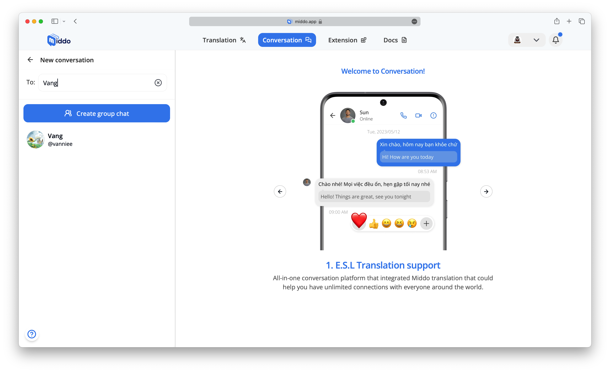  
  
**Send messages without language barriers**  
With Middo.app's integrated translation feature, you can communicate with people in different languages effortlessly. Just type your message in your preferred language, and Middo.app will handle the rest, ensuring smooth communication across language differences  
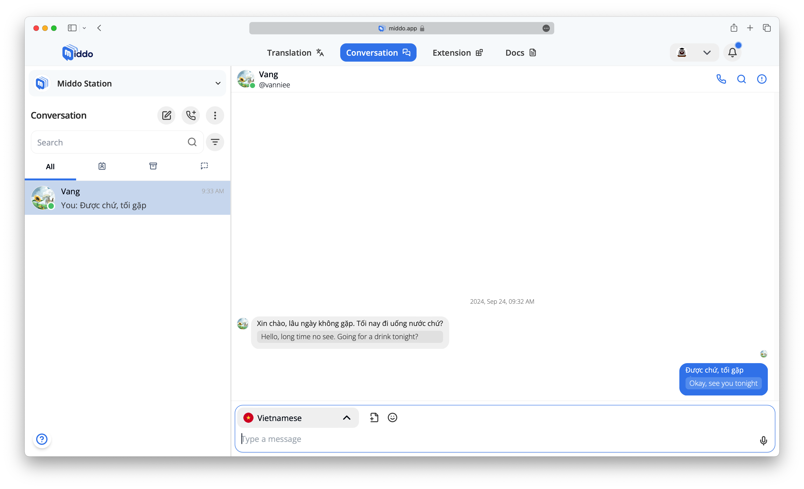  
  
### 2. Group Messaging  
  
**Create a group**  
Click the **Create Group** icon (usually a plus sign or a group symbol)  
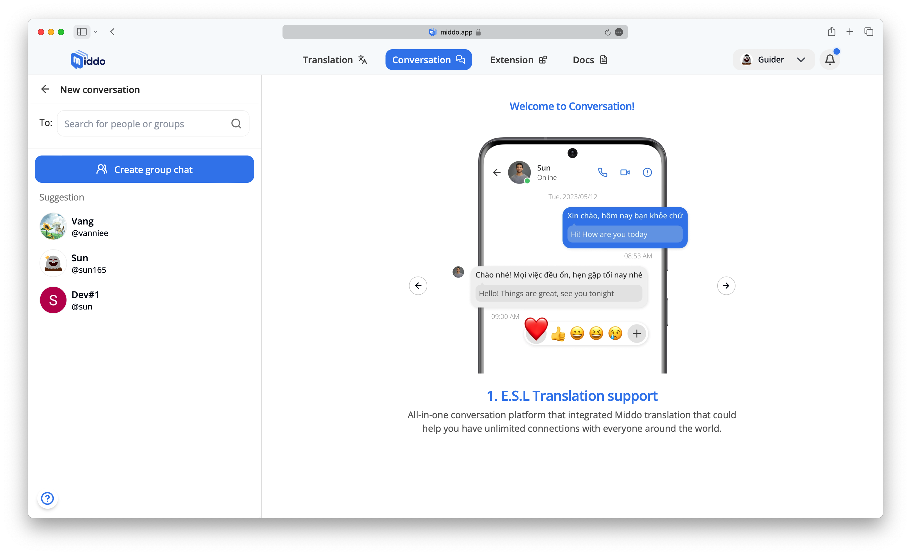  
  
**Search for users**  
Add users to the group by searching for their names, usernames, or emails  
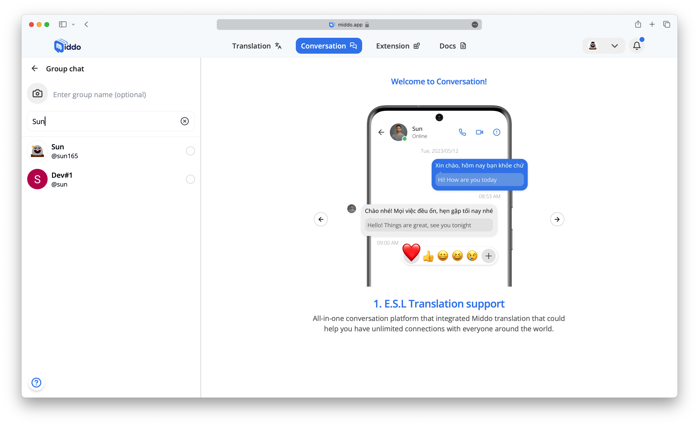  
  
**Name and Customize Your Group (optional)**  
Choose a name for the group and select a cover image to personalize it  
  
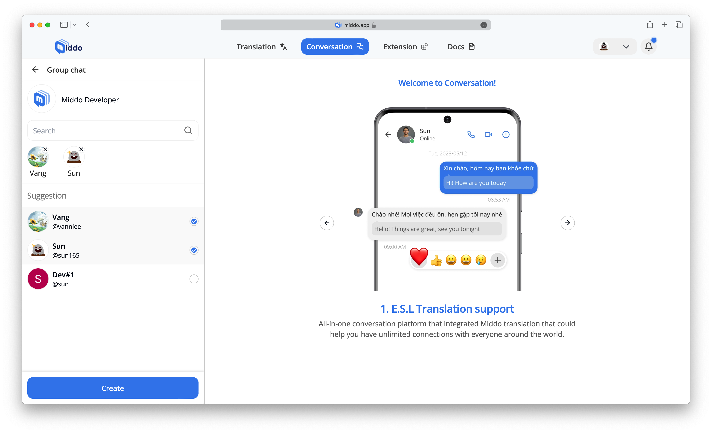  
  
**Click "Create"**  
Click the **Create** button to finish creating the group  
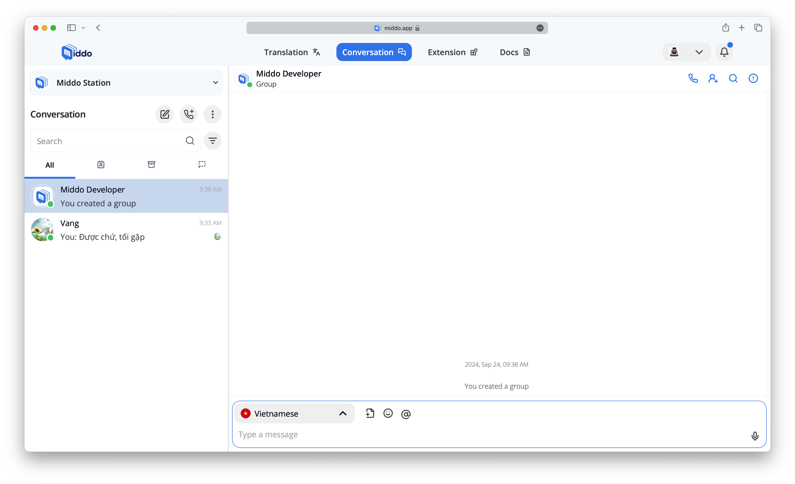  
  
### 3. Make a Call  
  
**Start a call**  
Click the **New Call** icon (usually a phone symbol)  
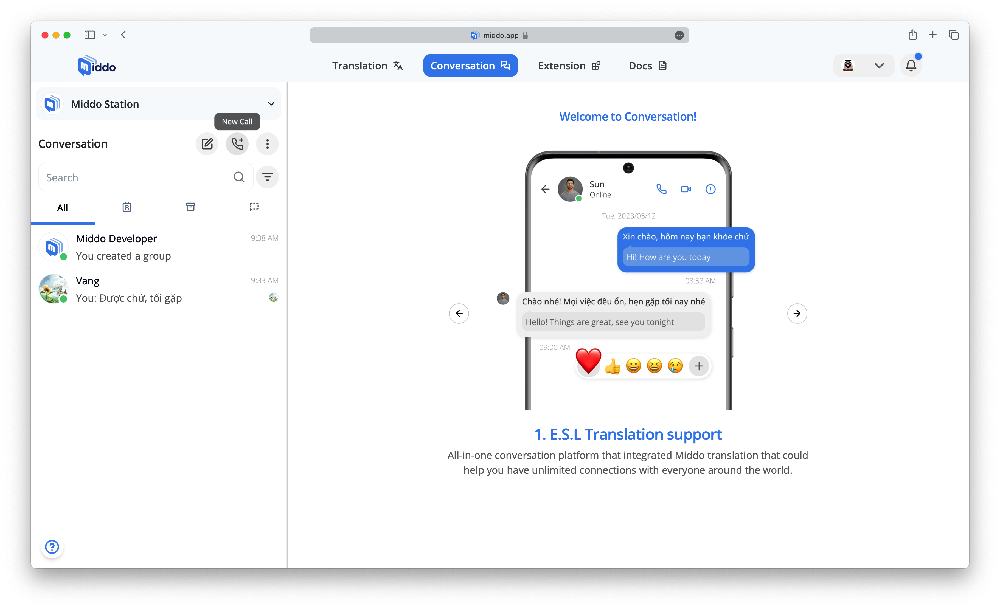  
  
**Choose your call type**  
You can start a call with **an individual user**, **a group**, or initiate an **instant call**  
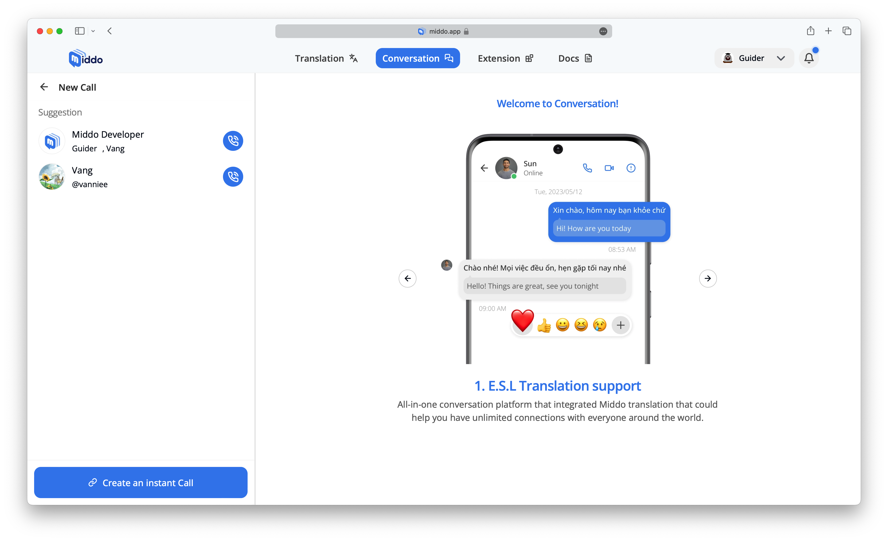  
  
**Invite participants** (Instant call only)  
For instant calls, copy the call link and share it with the people you want to invite  
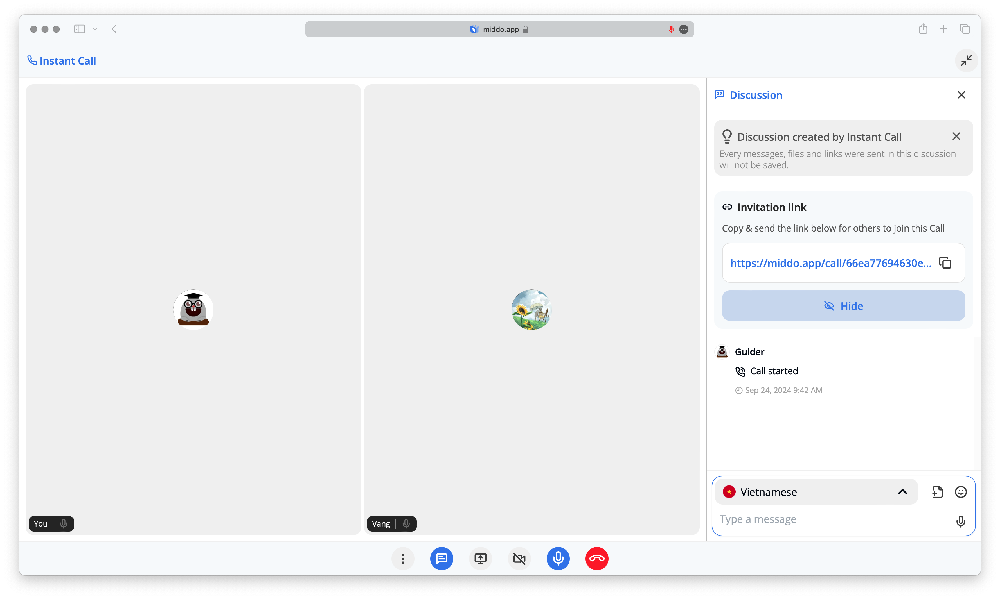  
  
**Diverse communication**  
You can text, show video, share your screen, send files, participate in discussions, and use voice during the call  
