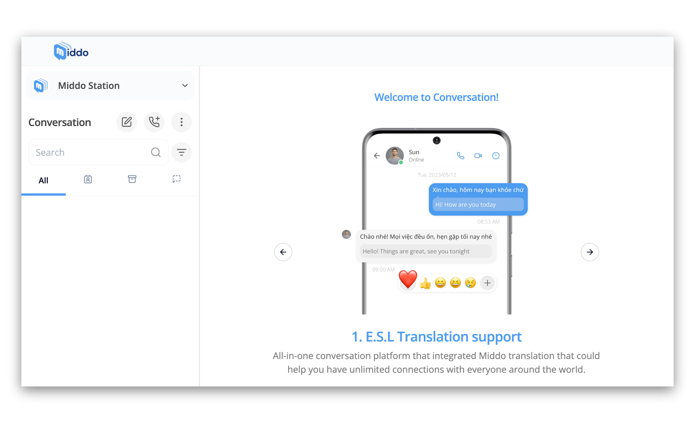
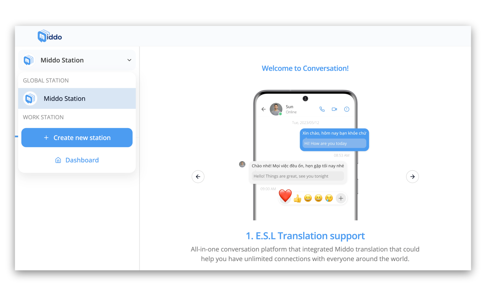
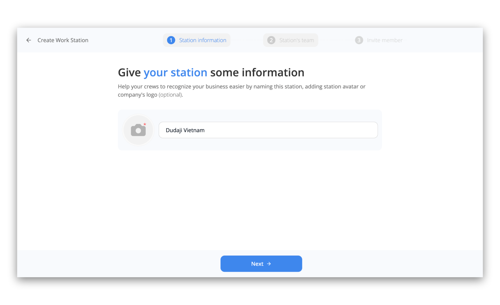
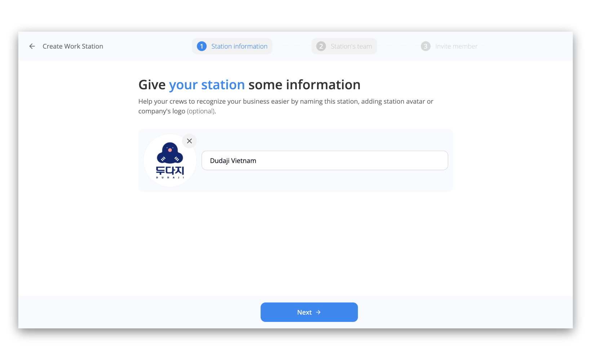
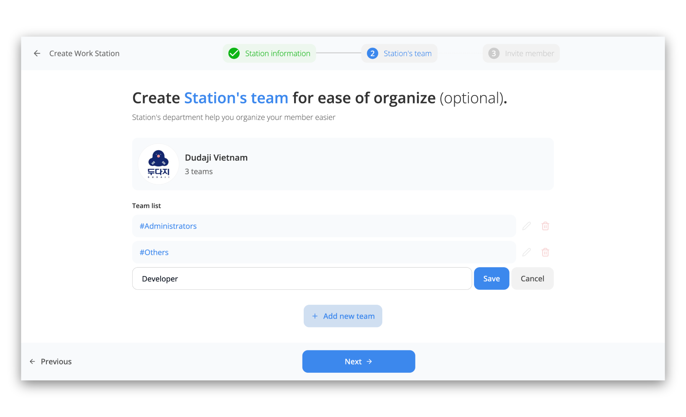
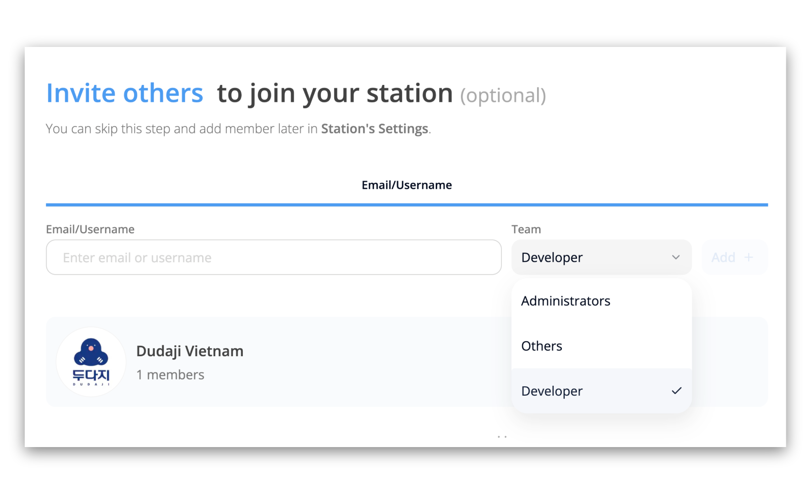
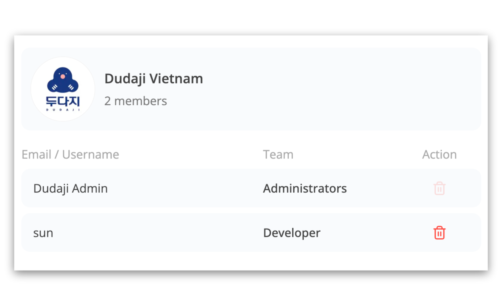
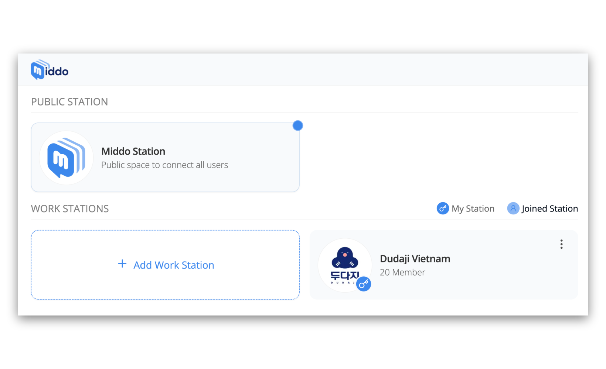
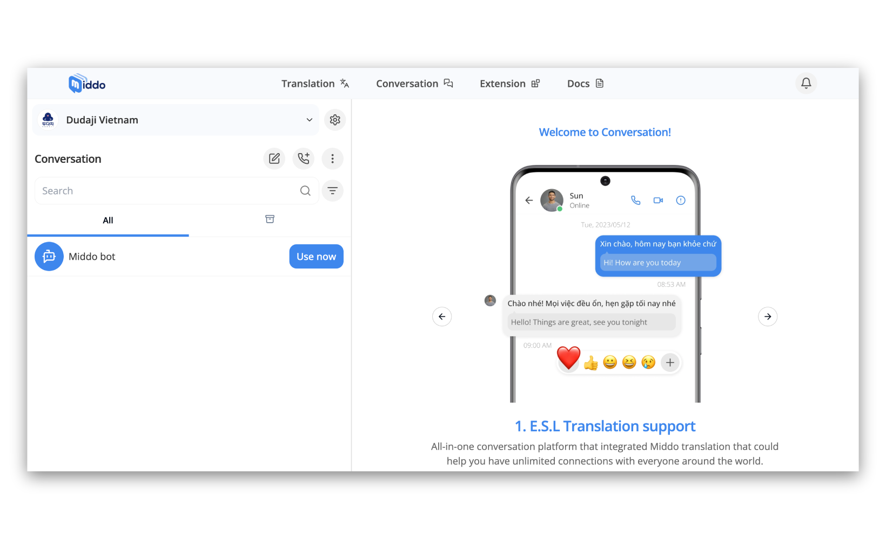

# Create new Station

This guide will walk you through the process of creating a Middo Station, a collaborative workspace within the Middo application

### Step 1: Access Station creation page

**1\. Go to middo.app**  
Open your web browser and navigate to [middo.app](https:/middo.app). Then click on your current station  
  
**2\. Click "Create new station"**  
Locate and click the `Create new station` button. This will take you to the station creation page  

### Step 2: Name Your Station

**1\. Enter a Station Name**  
You'll be prompted to enter a name for your station. Choose a name that's descriptive and easy for your team to recognize  

**2\. Add an Avatar (Optional)**  
You can upload a station avatar or company logo to personalize your station. This is optional but can help your team identify the station easily  

### Step 3: Build Your Team

**Add New Teams**  
Click on the `Add new team` button. This will allow you to create teams within your station to organize members based on roles, projects, or departments. Enter the name of the team and click `Save`  

### Step 4: Invite Members

**Invite by Email/Username and choose team**  
Enter the username or email address of the person you want to invite along with their role in the designated field  
  
Click the `Add` button  

You can also **invite members by sharing a link**. This link can be generated after you've created station. We'll guide you through this process later on [Invite member guide](./invite-members)

### Step 5: Access Station

After successfully creating your station, click on the newly created station to begin chatting and working  
  

