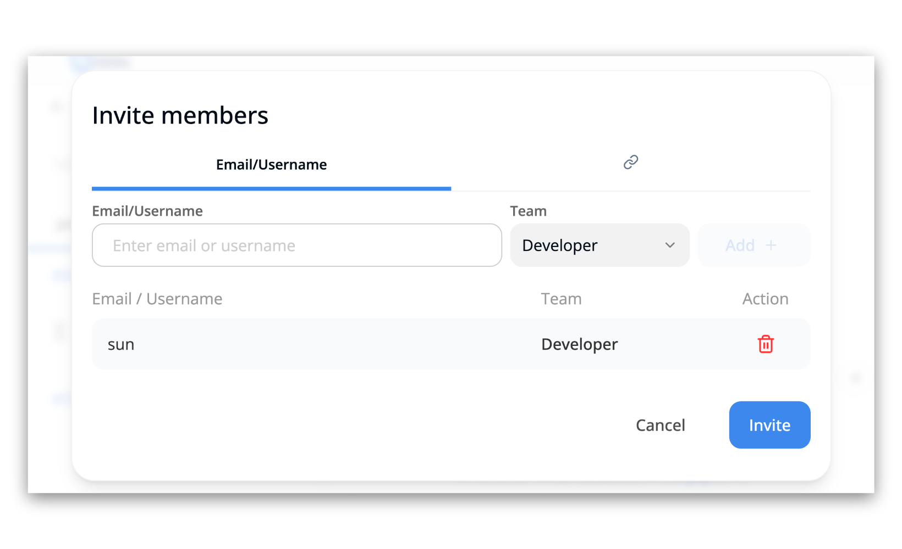
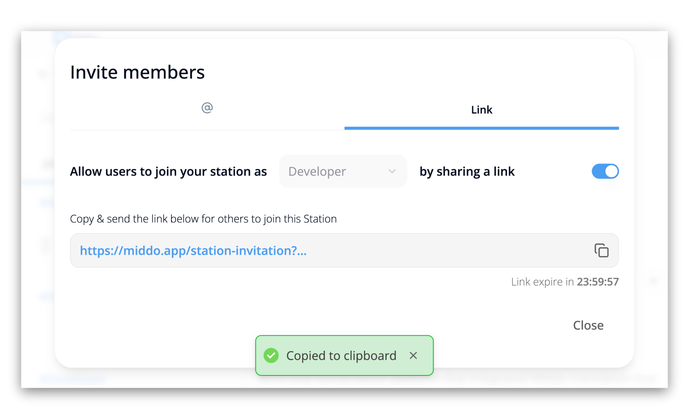

---  
sidebar_position: 2  
hide_table_of_contents: true  
custom_edit_url: null  
pagination_next: null  
pagination_prev: null  
title: Invite Members  
---  
# Invite Members to Middo Station  
   
This guide will walk you through the process of inviting members to your Middo Station    
  
## Step 1: Access the Members Section  
  
**1. Navigate to Station Settings**    
Open your Middo Station and go to the `Station settings` section    
  
  
**2. Select "Members"**    
Click on the `Members` option in the left-hand menu    
  
  
**3. Click on "Add Members" button**    
Click on the `Add Members` button in the top right corner    
  
  
  
  
## Step 2: Invite member  
  
### Method 1: Inviting by Email/Username  
   
**1. Enter Email/Username**  
Enter the email address or username of the person you want to invite    
  
  
**2. Choose Team**    
Select the team you want to add the member to    
  
  
**3. Add Member**    
Click the `Add +` button to add the member to your station    
  
**4. Action**    
You can choose to **invite** the member **or reject** their invitation    
  
  
### Method 2: Inviting by Link  
  
**1. Choose Role**  
Select the role you want to assign to members who join using this link  
  
  
**2. Enable Link Sharing**  
Toggle the switch to the ON position. This will generate an invitation link  
  
  
**3. Copy Link**  
Click on the button on the right side of the link box to copy the generated link.    
  
  
**4. Share Link**  
Share the link with the people you want to invite to your station    
  
:::info **Important Notes:**  
-  You can invite members by email/username or by sharing a unique invitation link
-  The invitation link has an expiration time, so make sure to share it with your team members before it expires    
:::
  
  
