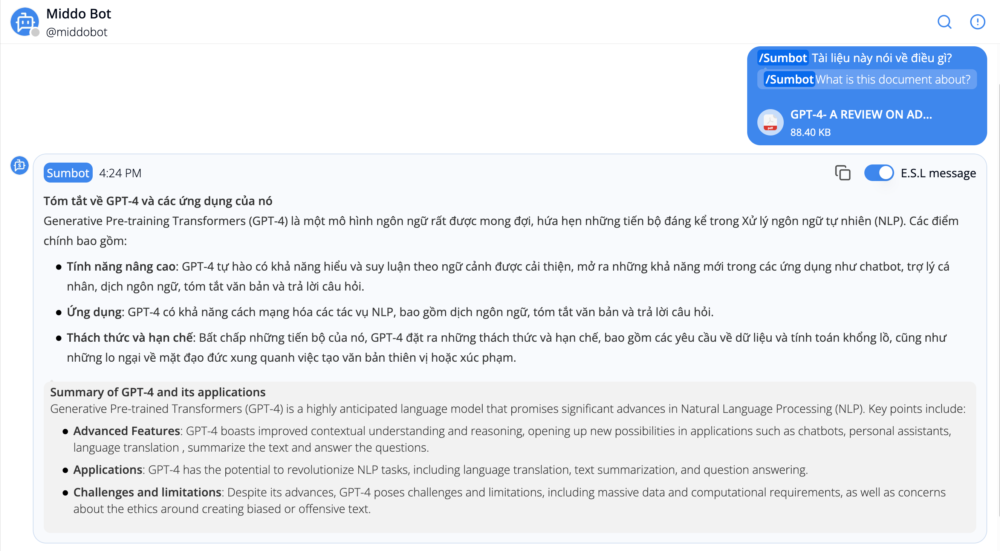

---  
sidebar_position: 3  
hide_table_of_contents: true  
custom_edit_url: null  
pagination_next: null  
pagination_prev: null  
title: Summary Bot  
  
---  
# Middo Bots  
### Sumbot (Summary Bot)  
  
  
  
  
**Purpose:**  Sumbot is a powerful tool for collecting and summarizing information  
**Functionality:**  It can gather feedback from team members, generate reports, and create summaries of documents or discussions  
**Examples:**  
- Collecting feedback on project ideas  
- Summarizing key findings from a meeting  
- Creating a concise summary of a lengthy document.   
  
**How to use?**  
-  **In Discussion**: Type `/Sum` bot then hit **Enter** to request the bot to summarize the entire conversation  
-  **In Any Conversation**: Type `/Sum bot` after adding a file into the input message box. Then hit **Enter** to send the file and request the bot to summarize this file  
  
**Example Output:**  
- **Input:** A document containing a detailed description of GPT-4, its capabilities, and limitations  
- **Command:** `/Sum bot`  
- **Result:**  
  
  
:::note **Tóm tắt về GPT-4 và các ứng dụng của nó**  
Generative Pre-training Transformers (GPT-4) là một mô hình ngôn ngữ rất được mong đợi, hứa hẹn những tiến bộ đáng kể trong Xử lý ngôn ngữ tự nhiên (NLP). Các điểm chính bao gồm:   
- **Tính năng nâng cao:** GPT-4 tự hào có khả năng hiểu và suy luận theo ngữ cảnh được cải thiện, mở ra những khả năng mới trong các ứng dụng như chatbot, trợ lý cá nhân, dịch ngôn ngữ, tóm tắt văn bản và trả lời câu hỏi  
- **Ứng dụng**: GPT-4 có khả năng cách mạng hóa các tác vụ NLP, bao gồm dịch ngôn ngữ, tóm tắt văn bản và trả lời câu hỏi  
- **Thách thức và hạn chế:** Bất chấp những tiến bộ của nó, GPT-4 đặt ra những thách thức và hạn chế, bao gồm các yêu cầu về dữ liệu và tính toán khổng lồ, cũng như những lo ngại về mặt đạo đức xung quanh việc tạo văn bản thiên vị hoặc xúc phạm.  
:::  
:::info **Summary of GPT-4 and its applications**  
Generative Pre-trained Transformers (GPT-4) is a highly anticipated language model that promises significant advances in Natural Language Processing (NLP). Key points include:  
- **Advanced Features:** GPT-4 boasts improved contextual understanding and reasoning, opening up new possibilities in applications such as chatbots, personal assistants, language translation , summarize the text and answer the questions  
- **Applications:** GPT-4 has the potential to revolutionize NLP tasks, including language translation, text summarization, and question answering  
- **Challenges and limitations:** Despite its advances, GPT-4 poses challenges and limitations, including massive data and computational requirements, as well as concerns about the ethics around creating biased or offensive text  
:::