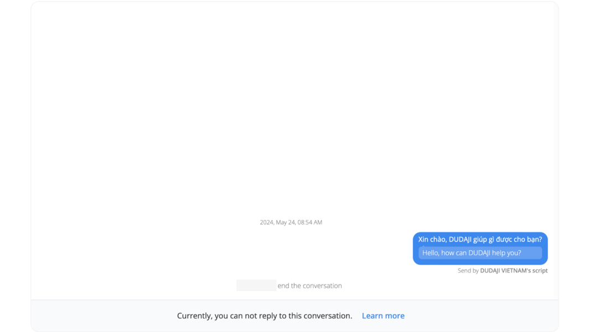

# Why I can NOT reply to a conversation

Sometimes, you will can NOT reply to a conversation if
- In Conversation page: You’re blocked by a user
- In Extension page: The user you want to send message has left the conversation, or this conversation is timed out
