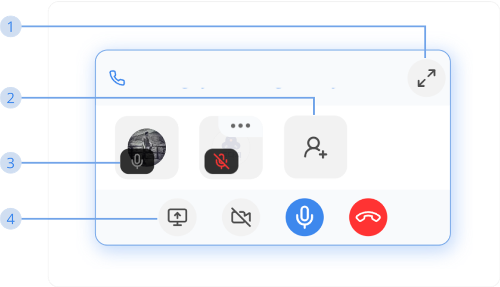

# How to Use Conversation  

### Middo Call (Minimize Mode)  

**1. Change to Maximize Mode**  
Click this button to maximize the Middo Call screen

**2. Add Member to Join Call (Group only)**  
When a Middo Call is started, only invited-to-join members receive the calling notification screen

**3. Microphone Status**  
This status to represent for who is turn on or off their microphone.

**4. Middo Call Tools**  
In minimize mode, there are 4 default tools to use:
- Share screen
- Turn on/off camera
- Turn on/off microphone
- Leave call
