# How to embed Conversation to your website?

### Step 1: Create a Space  

1\. Go to https://middo.app/spaces
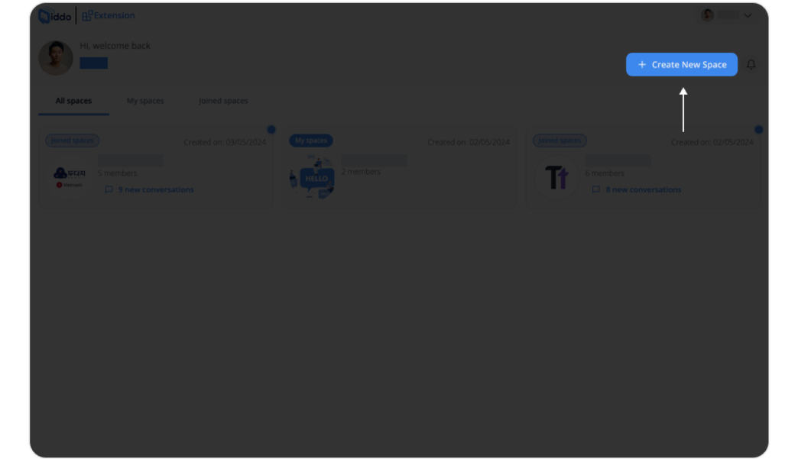

2\. Click “Create New Space”: Then give your space a name, avatar, and add members
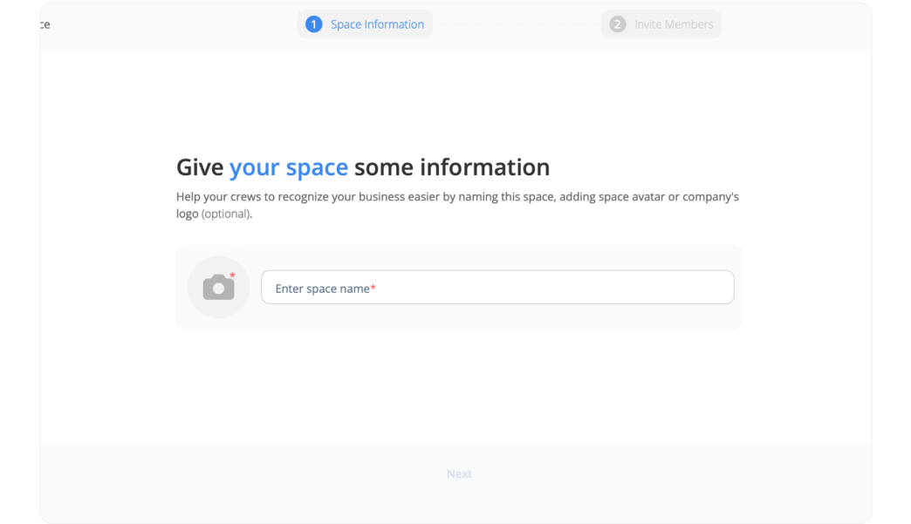

### Step 2: Create Your Extension  

1\. Go to the “Settings” page. Move to the “Conversation Extension” tab  
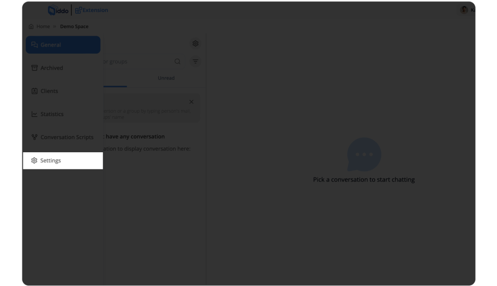

2\. Click “Create Extension” and set up your extension 
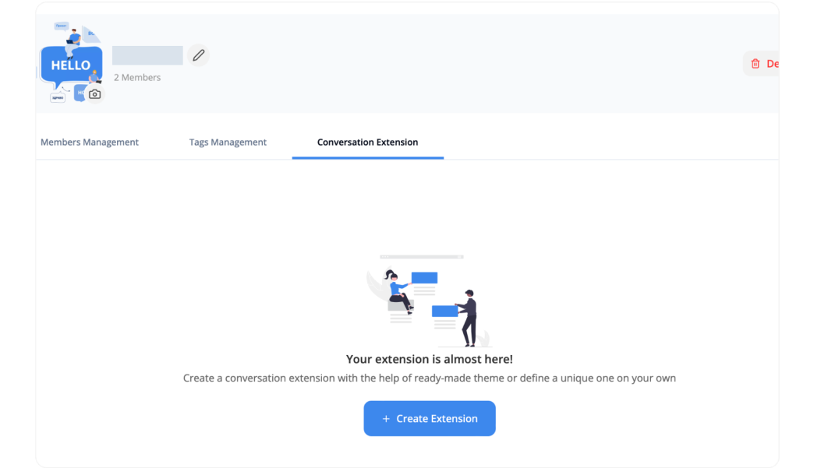

   3.1\. Set up your domain (the list of public sites that you allow your Conversation Extension to appear on)  
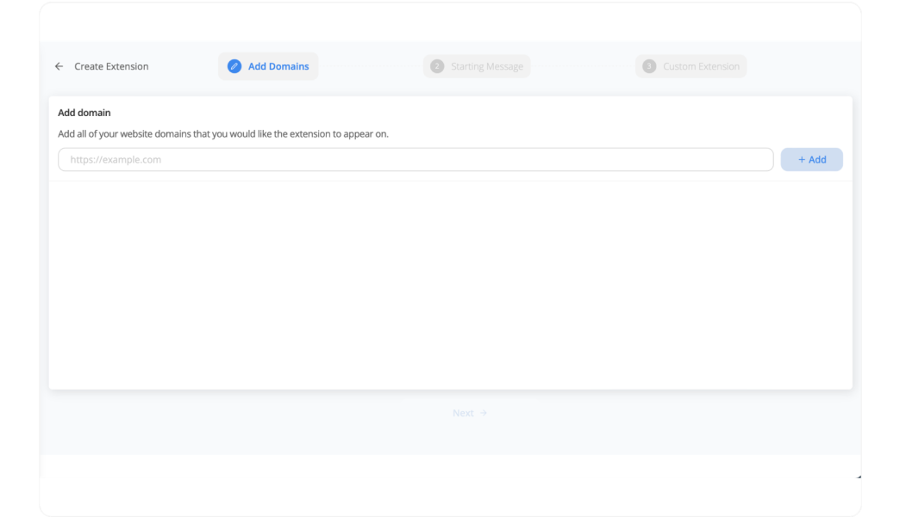

   3.2\. Set up your starting message. There are 3 options:  
      - Default: A default message to greet and guide users  
      - Custom: Write your own greeting message  
      - Scripted conversation: Choose available script or create your new script
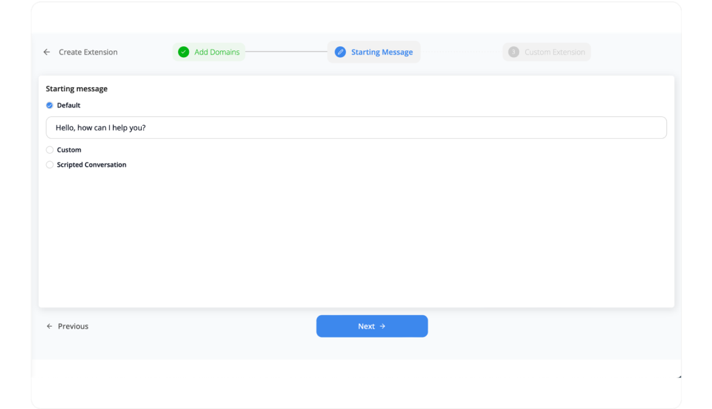

   3.3\. Customize your Extension. You can choose: Theme, Conversation icon, and other options  
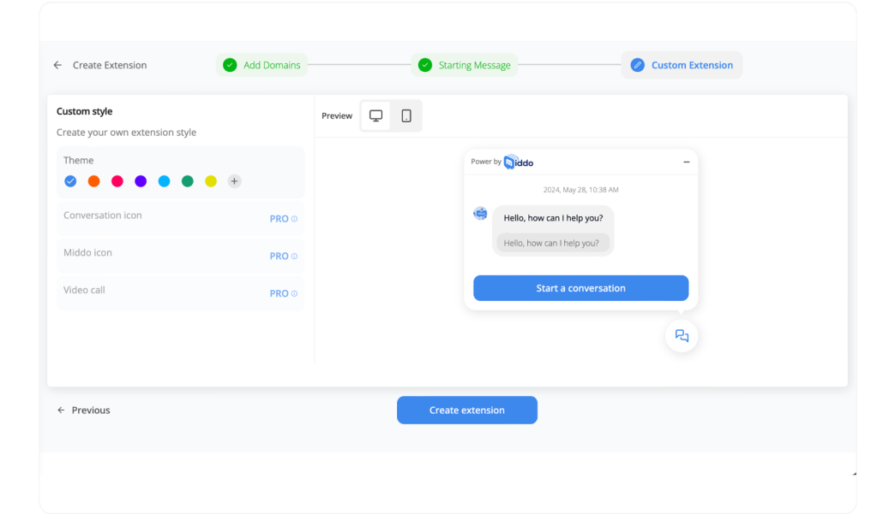

4\. Copy embed code: After created Conversation Extension, you can copy your embed code on your setting page
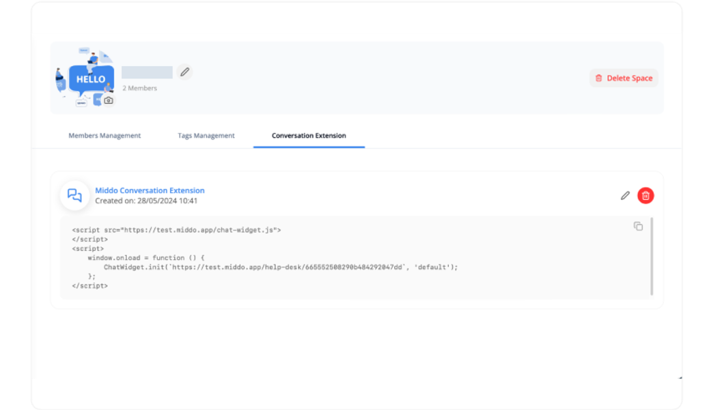

### Step 3: Paste the embed code to your website
Adding the embed code to your website may vary depending on the type of website platform you are using. Here are some basic instructions for some popular platforms:

**1\. Embedding into the HTML source code of your website:**  
If you have access to the HTML source code of your website, you can directly paste the embed code there. For example:  
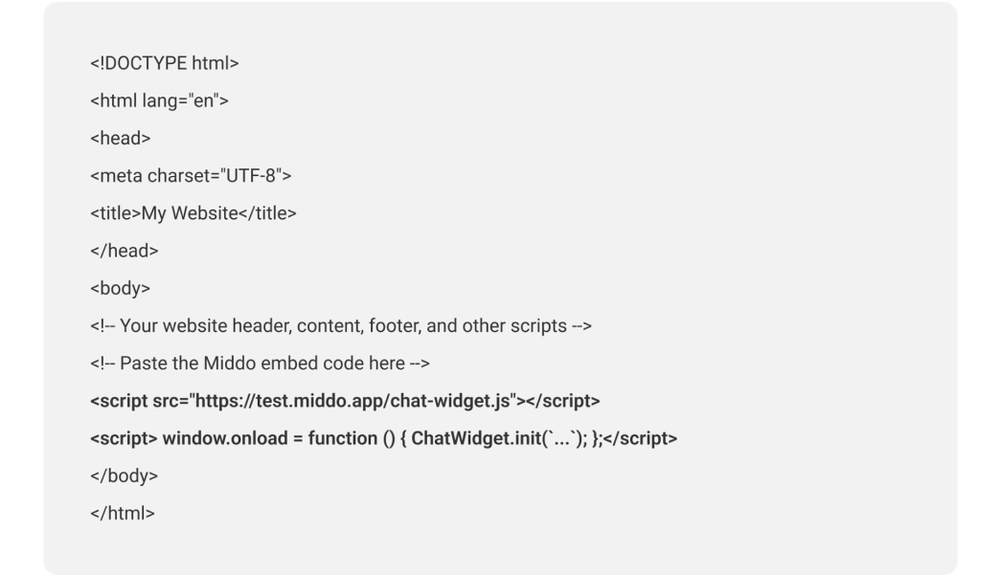

**2\. Using Content Management Systems (CMS):**  
If you're using WordPress, you can add the embed code:  
a. Access your WordPress (https://wordpress.com/login)

b. Adding an embed:  
Click on “Pages”
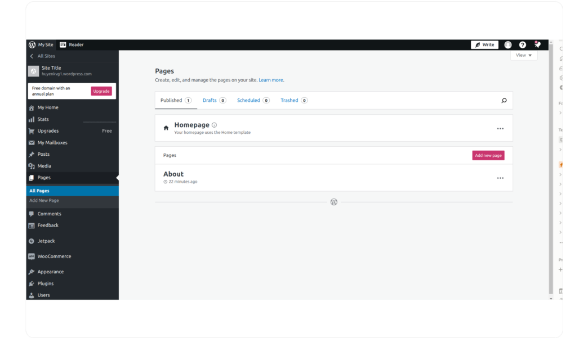

Click on the page you want your chat, or click on "Add new page”
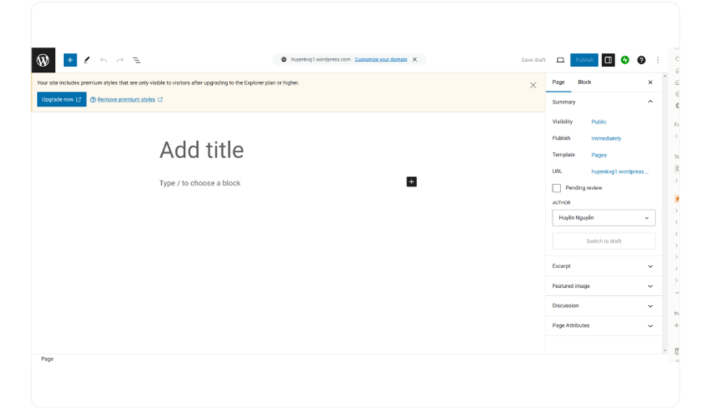

c. Setting up an embed  
Click on the "+" icon
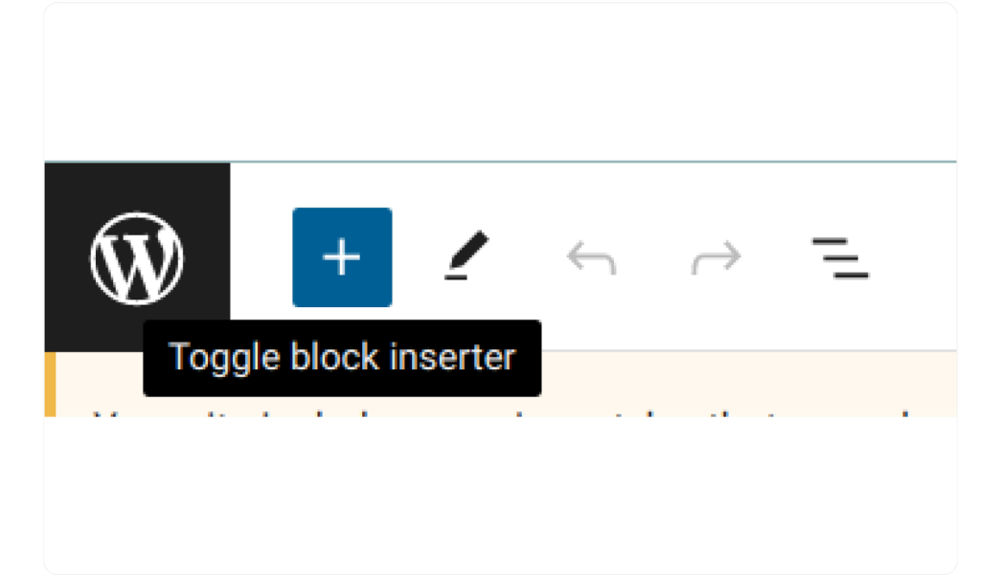

Search for "Custom HTML" and click it
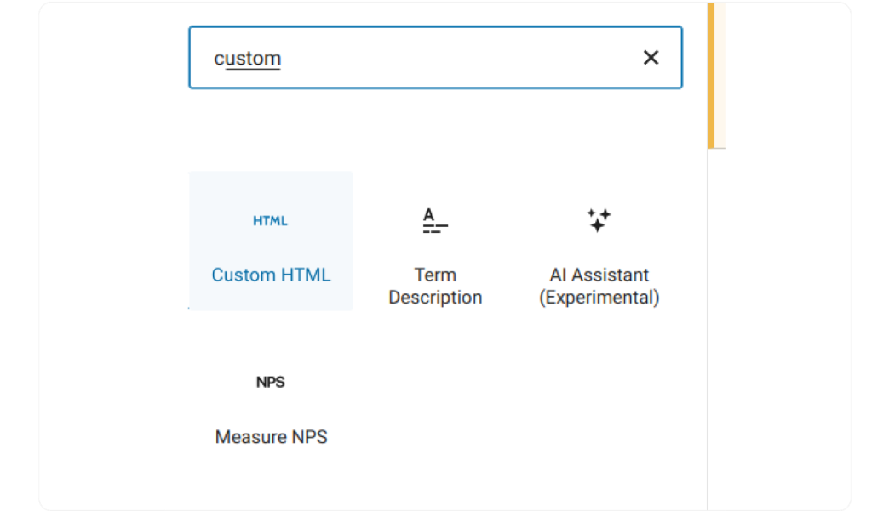

Paste your Code inside the HTML block
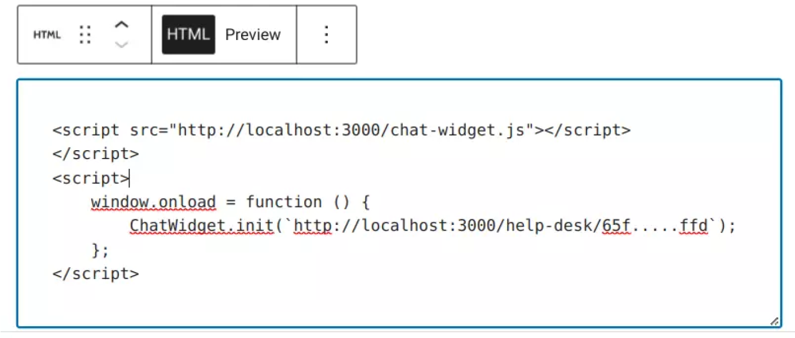

d. Save your change

**3\. Contacting your website administrator**  
You can contact your website administrator or developer if you cannot add the embed code. Please provide them with the embed code and instructions to add it to your website