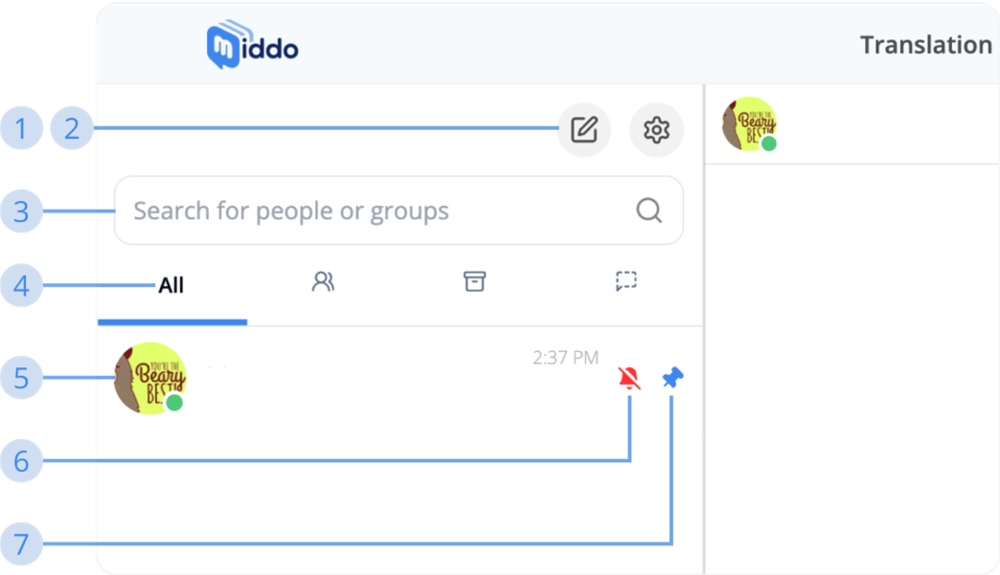

# How to use Conversation

### Conversation List  

**1. New Message Button**  
Click this button to create a Personal conversation or Group conversation.

**2. Conversation’s Settings**  
Click this button to toggle: 
- Translation tool  
- E.S.L translated messages

**3. Search Bar**  
Enter a username, person’s name, or group’s name to search.

**4. Conversation’s Tabs**  &nbsp;
- **All**: contains all types of conversations  
- **Group**: contains only group type conversations  
- **Archive**: contains only archived conversations  
- **Waiting**: contains only un-know user's conversations

**5. Avatar / Name / Message**  
- **Avatar**: the representative image of a person or group  
- **Name**: the person’s name or group’s name  
- **Message**: content of the last message in the conversation

**6. Notification-off Icon**  
This icon will be shown whenever the conversation’s notification is turned off by yout

**7. Pin Conversation Icon**  
This icon will be shown whenever you pinned any conversations to top