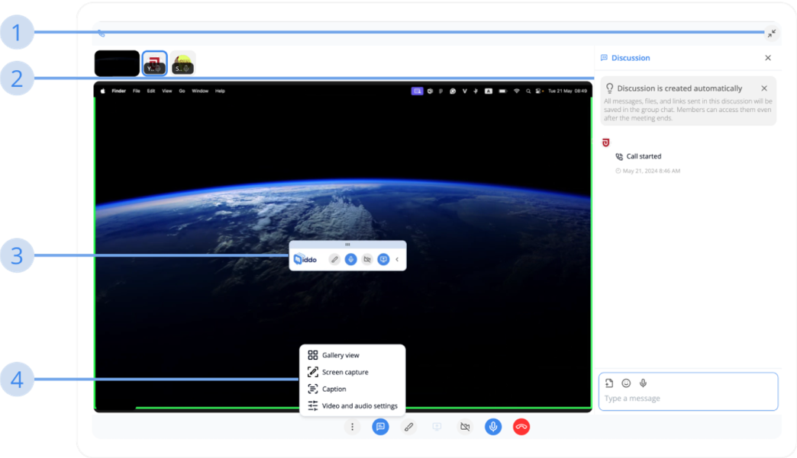

---  
sidebar_position: 7  
hide_table_of_contents: true  
custom_edit_url: null  
pagination_next: null  
pagination_prev: null  
title: Middo Call (Maximize Mode)  
---  
  
# How to use Conversation  
  
### Middo Call (Maximize Mode)  
  
  
  
**1. Change to Minimize Mode**  
Click this button to minimize the Middo Call screen  
  
**2. Discussion**  
When a Middo Call is started, a discussion is auto-generated to save all of your messages through Middo Call  
  
**3. Share Screen Tools (Desktop App Only)**  
Whenever you start sharing your screen, a tool box will be displayed at the top to help you manage your screen:  
- Doodle: Allows you to draw on your screen. The drawn line will auto disappear after a few seconds  
- Turn on/off microphone  
- Turn on/off camera  
- Stop sharing screen  
  
**4. Advanced Middo Call Tools**  
In maximize mode, there are 4 advanced tools to use:  
- Gallery View  
- Screen capture (Only work when sharing screen happens): Quickly take a screenshot of the shared screen, all member join this call could draw on it  
- Caption: Speech-to-Text all member voice, and auto translate to the receiver’s native language  
- Video and Audio Settings  
