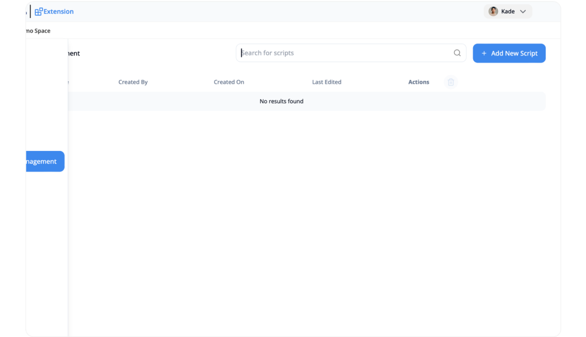
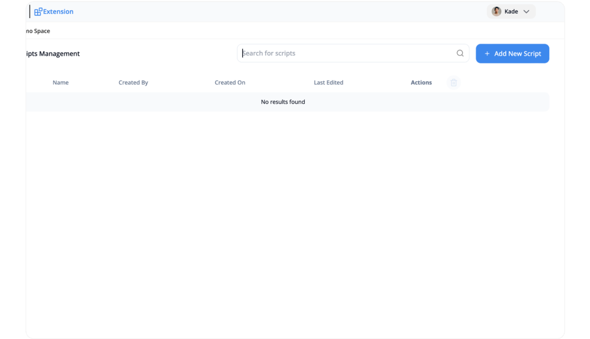
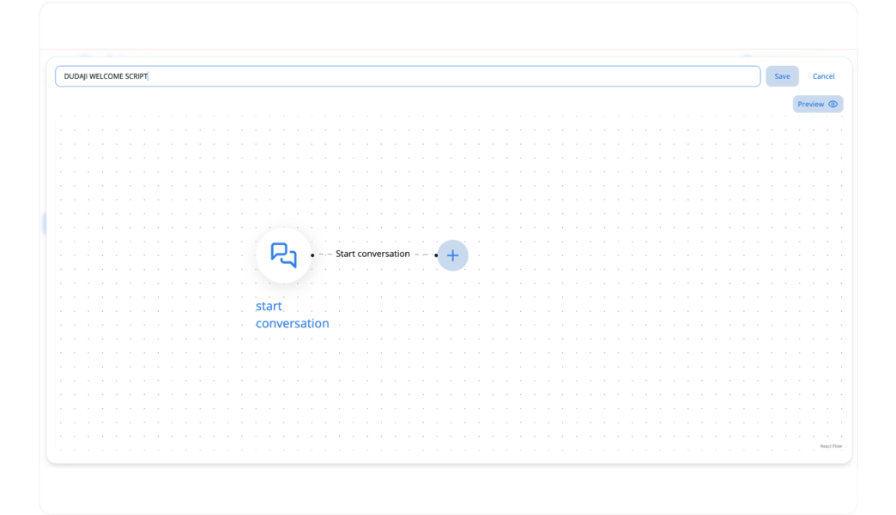

---  
sidebar_position: 2  
hide_table_of_contents: true  
custom_edit_url: null  
pagination_next: null  
pagination_prev: null  
title: How to Manage Your Script Conversation?  
---  
# How to Manage Your Script Conversationn  
  
Script Conversation guides for representatives to get the ball rolling in conversations. But Script Conversation can also double up as proactive messages in high-performing pages. You can use these messages to start conversations with website visitors even before they reach out to you  
  
### See your scripts from the “Scripts Management” page   
This page only available for Admin and Space’s owner  
  
  
### Create Your Script  
  
1\. Go to the “Scripts Management” page  
  
  
2\. Click on the “Add New Script” button  
  
  
3\. Enter the script name and design your own Script  
   Click the “Preview” button: it’ll open a new fake embed chat for you to test it out  
  
  
