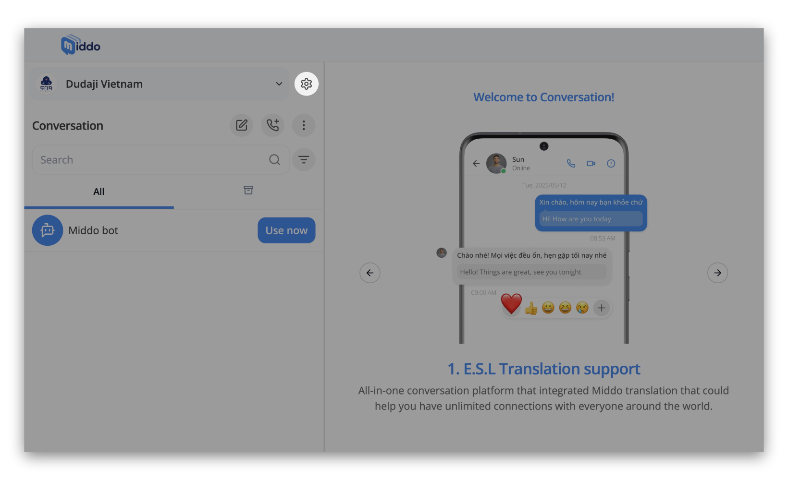
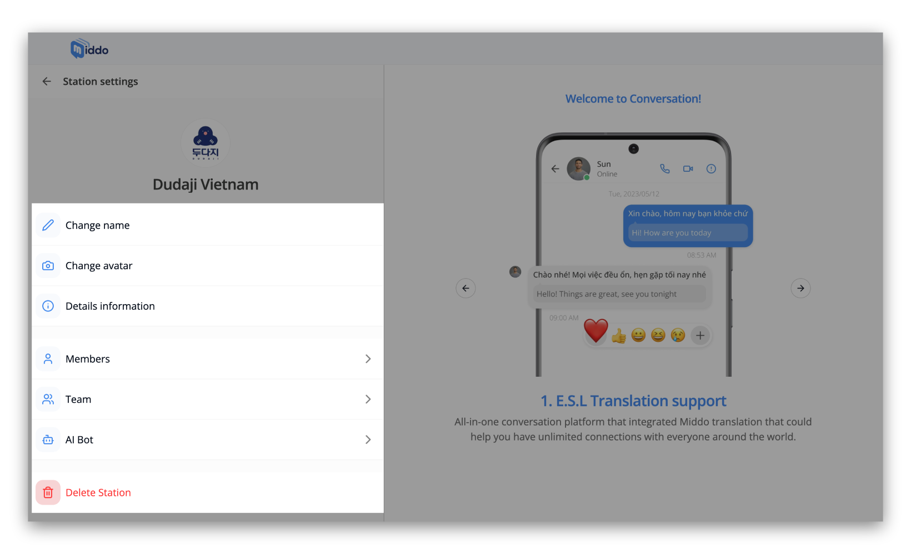
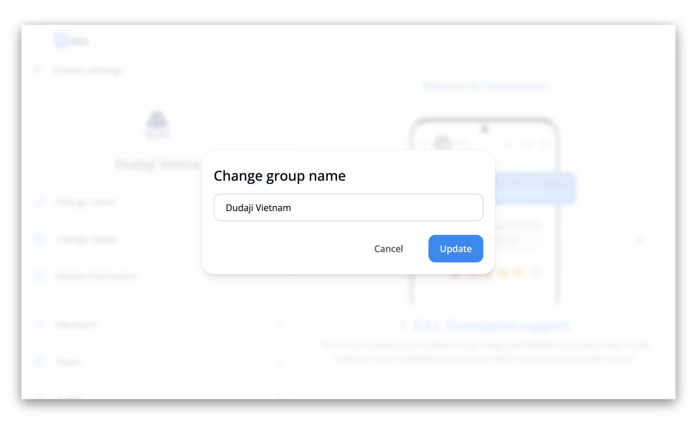
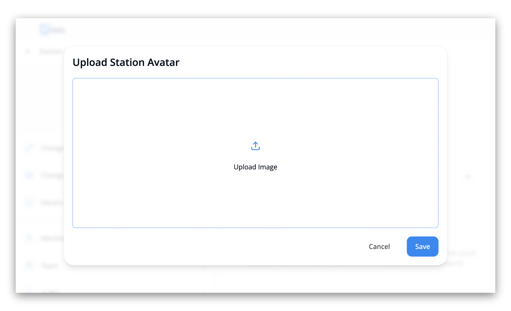
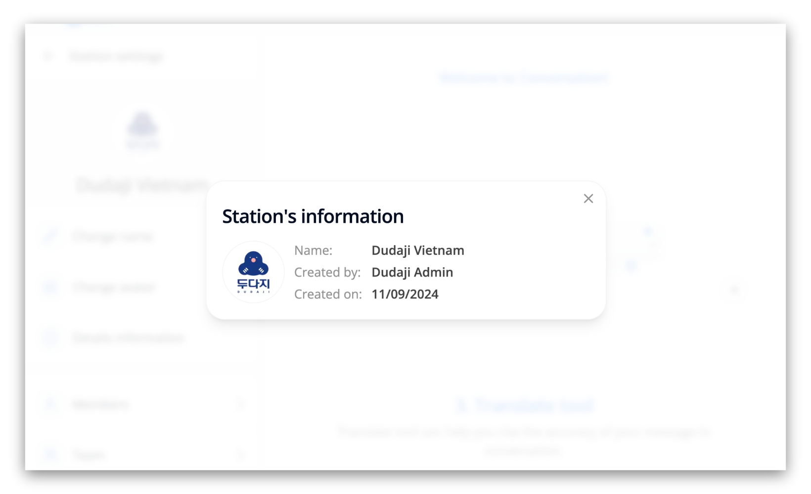
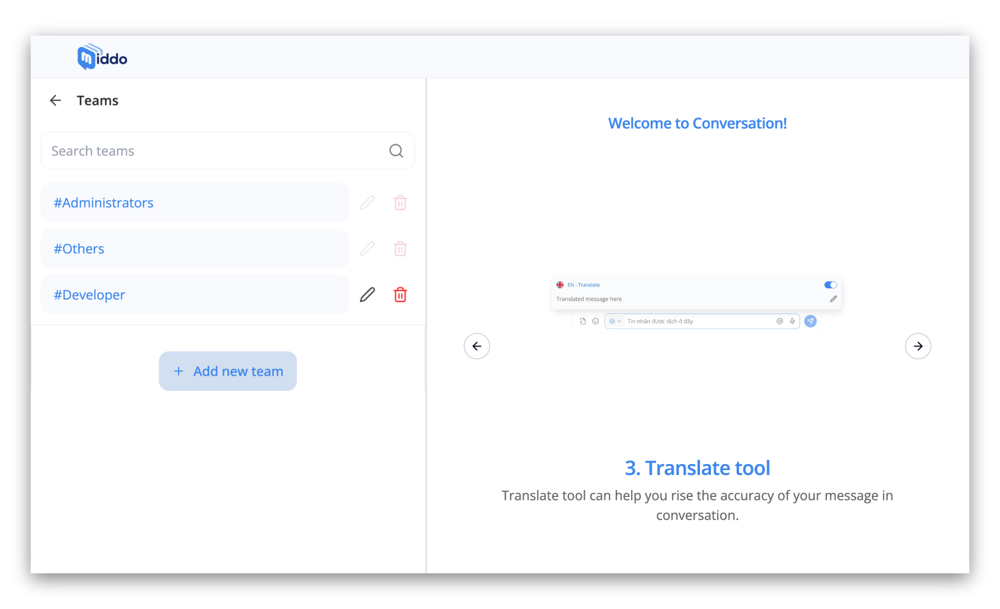
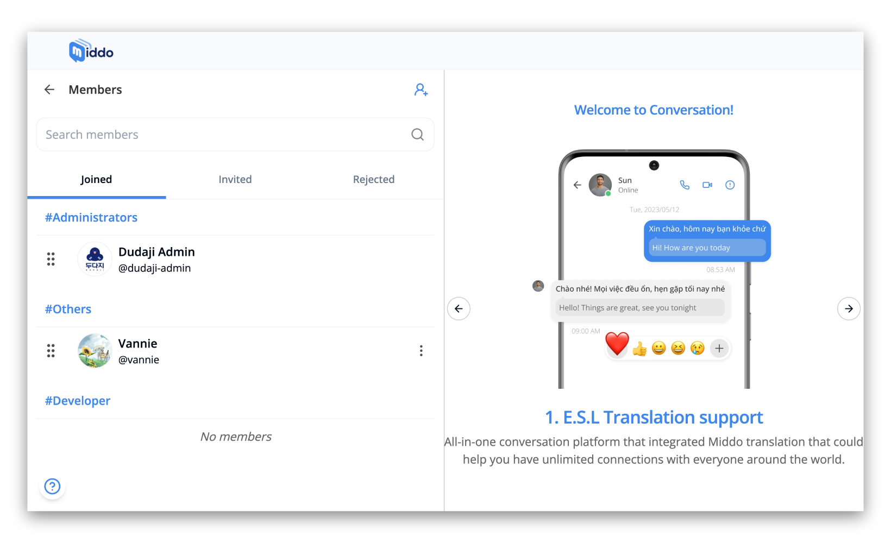
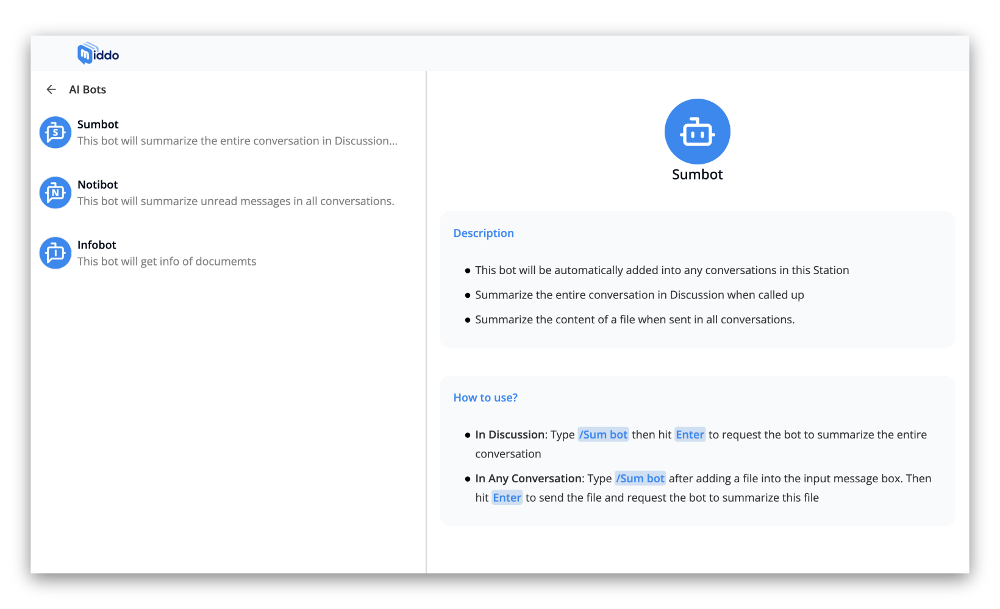
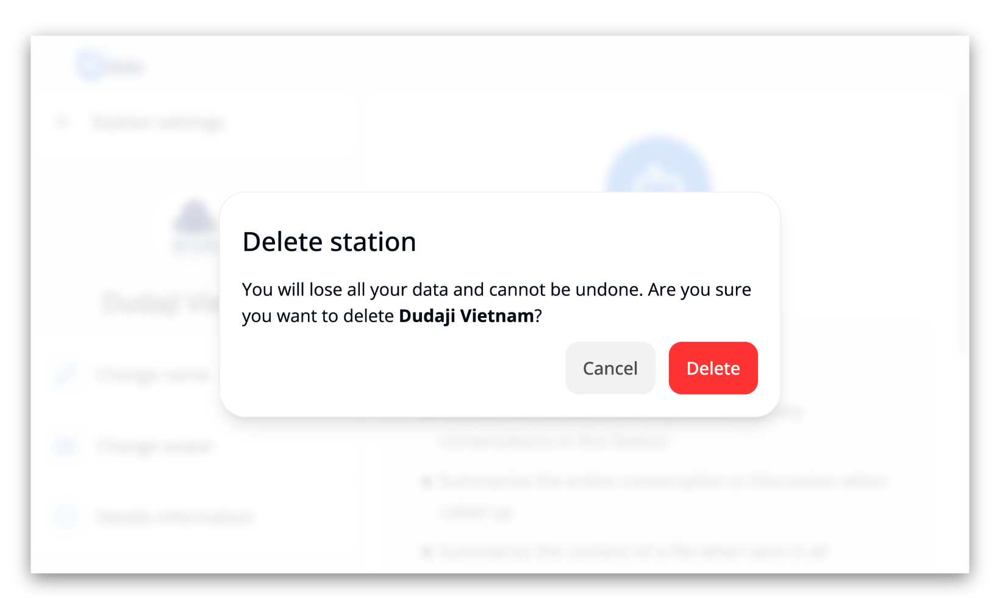

---  
sidebar_position: 1.1  
hide_table_of_contents: true  
custom_edit_url: null  
pagination_next: null  
pagination_prev: null  
title: Manage Station  
---  
  
# Manage Station  
  
After creating your Middo Station, you can customize its appearance and settings. Here's how to change the station name, avatar, and team:  
  
Open your Middo Station and go to the **Station settings** section  
  
Then, you can manage information such as:  
  
  
### **1. Change Station Name**  
  
Enter the new name for your station and click **Update** to save the changes  
  
  
### **2. Change Station Avatar**  
  
Click **Upload Image** to select an image from your computer. Choose an image and click **Save** to upload it as your station's avatar  
  
  
### 3. Station Information:  
  
On the **Station Information**, you can view details about your station, including:  
  
- **Name**: The name of your station  
- **Created by:** The user who created this station  
- **Created on:** The date when the station was created  
  
  
  
### **4. Manage Teams**  
  
You can add new teams, change the names of existing teams, or delete teams  
  
**To add a new team:**  
  
- Click **+ Add new team** button  
- Enter the team name and click **Save**  
  
**To change the name of an existing team:**  
  
- Click on **edit** icon on the right of team name  
- Enter the new team name and click **Update**  
  
**To delete a team:**  
  
- Click on **delete** icon on the right of team name  
- Click **Delete** to confirm delete the deletion  
  
### **5. Manage Members**  
  
  
You can view the members of your station and their roles. In this tab you can:  
  
- **Adjusting Team Affiliations:** Administrators have the power to rearrange team memberships by simply dragging and dropping members to their desired teams  
- **Removing a Member:** To remove a member from your station, locate their name in the member list, click the three dots to the right of their name, and select **Delete**  
- **Inviting New Members:** For detailed instructions on inviting new members to your station, please refer to the dedicated topic on [Invite Members](./invite-members) topic  
  
### **6. Manage AI Bots**  
  
Click on the **AI Bot** option  
You can add, manage AI bots within your station  
  
  
### **7. Delete Station**  
  
Click on the **Delete Station** option  
Confirm the deletion to permanently remove your station  
  
