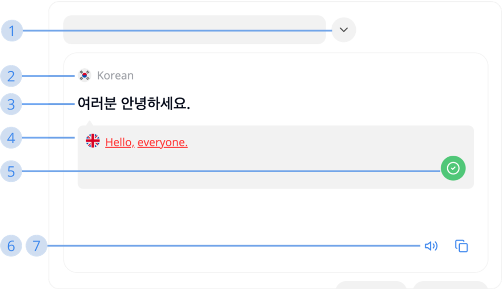

# How to use Translation

### Target  

**Target** is the right-side text box on the Translation page where your translated text is placed

**1. Show the list of supported languages**  
   Click this button to open the list of supported languages

**2. Target language**  
   The language you want to translate your text into

**3. Target text** 
   The content of your translation

**4. E.S.L translated from target**  
   The English translated text from your target text. Middo uses it to compare with the E.S.L translated from the source in order to give you a high accuracy translation. It will be displayed in 2 different colors, each meaning:  
   - **Red:** E.S.L source and E.S.L target are not matched  
   - **Green:** E.S.L source and E.S.L target are matched

**5. Confirm E.S.L translation**  
   When E.S.Ls are not matched, this button will be shown. Click it if you think the difference between the source and target E.S.L translated text is acceptable and usable. Until the green E.S.L shows up, you can use other advanced features

**6. Text-to-Speech**  
   Middo will read out loud what you have input

**7. Copy text**  
   Copy the text you have input
