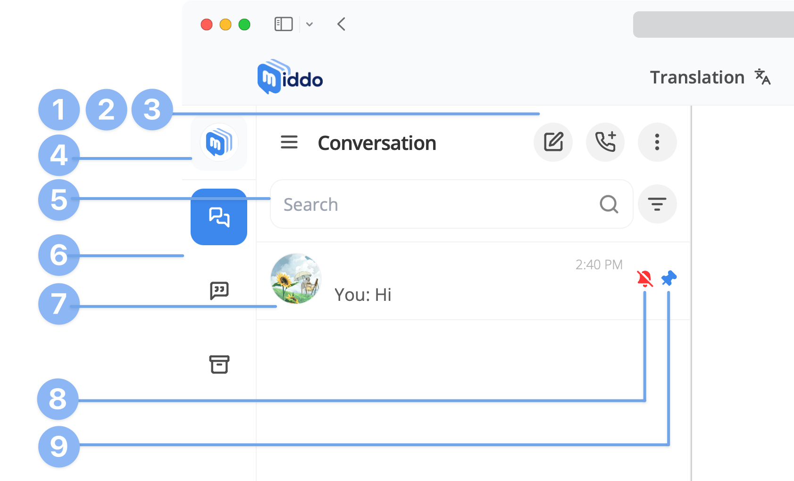

---  
sidebar_position: 1  
hide_table_of_contents: true  
custom_edit_url: null  
pagination_next: null  
pagination_prev: null  
title: Conversation List  
---  
  
# How to use Conversation  
  
### Conversation List  
  
  
  
**1. New Message Button**  
Click this button to create a Personal conversation or Group conversation  
  
**2. New Call Button**  
Click this button to start a new call with a contact or group.

**3. Conversation’s Settings**  
Click this button to toggle:   
- Translation tool  
- E.S.L translated messages  
  
**4. Change Station Button**  
Click this button to switch to a different station.

**5. Search Bar**  
Enter a username, person’s name, or group’s name to search  
  
**6. Conversation’s Tabs**  &nbsp;  
- **All**: Contains all conversations  
- **Discussion**: Contains ongoing conversations  
- **Archive**: Contains only archived conversations  

**7. Avatar / Name / Message**  
- **Avatar**: the representative image of a person or group  
- **Name**: the person’s name or group’s name  
- **Message**: content of the last message in the conversation  
  
**8. Notification-off Icon**  
This icon will be shown whenever the conversation’s notification is turned off by yout  
  
**9. Pin Conversation Icon**  
This icon will be shown whenever you pinned any conversations to top
