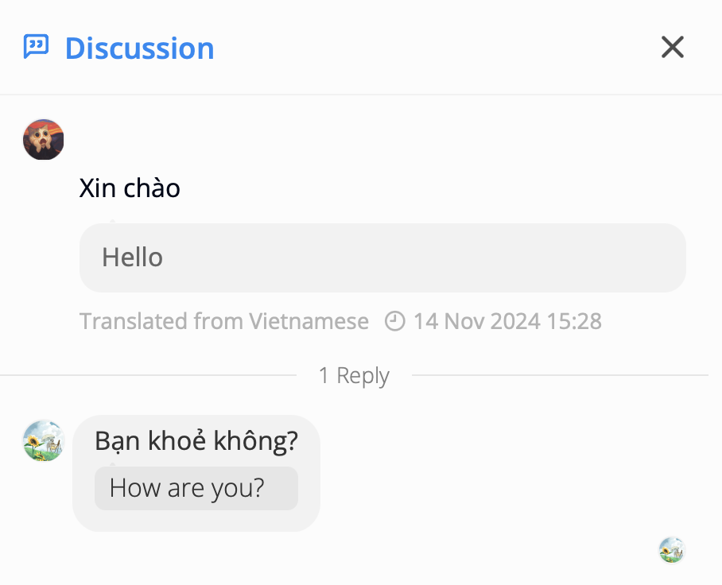

# How to use Conversation

### Discussion

**1. What is Discussion**  
Whenever someone replies to your message. Discussion will be created

**2. Notification in Discussion**  
You will receive notifications in Discussion, whenever you are relative to this Discussion:

- If you're mentioned in any message of Discussion

- If you reply in a Discussion

**3. Accessing a Discussion**  
You can access a Discussion in two ways:

- View it in the details of the conversation
- View the list of Discussions in the Conversation tab
  

**4. Features in the Discussion List**

- **Toggle Notifications**: If notifications are turned off, you can click to turn them back on
- **View Participants**: Click the reply count to quickly see who has participated in the Discussion. You can then click to open the detailed Discussion view
- **Quick Reply Button**: Click this button to open a quick reply section
- **Quick Reply Input**: The area where you can input and send a quick reply message
  
