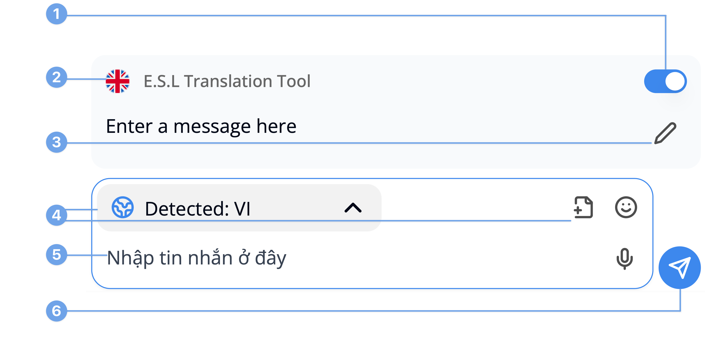

---  
sidebar_position: 4  
hide_table_of_contents: true  
custom_edit_url: null  
pagination_next: null  
pagination_prev: null  
title: Input Message Box  
---  
# How to use Conversation  
  
### Input Message Box  
  
  
  
**1. Toggle E.S.L Translation Tool**  
Toggle to turn on/off the E.S.L translation tool  
  
**2. E.S.L Translation Tool**  
Translate your message content into English to ensure the accuracy of translation  
  
**3. Edit E.S.L Translated Text**  
If the E.S.L translation does not accurately reflect your original text, you can edit it to correct it  
  
**4. Input Tools**  
It will contains:  
- Select input language  
- Send images/videos/files  
- Send emoji  
- Speech-to-text  
- Mention (only works in Group conversations)  
  
**5. Input Text**  
The place to input your message content  
  
**6. Send**  
Only appears whenever input message box has content or the content has been finished translated