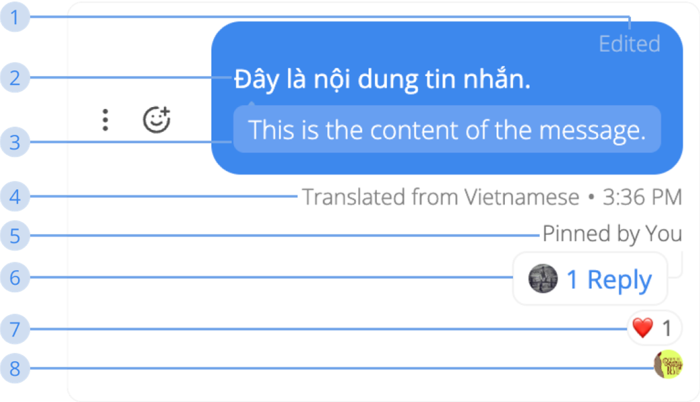

---  
sidebar_position: 3  
hide_table_of_contents: true  
custom_edit_url: null  
pagination_next: null  
pagination_prev: null  
title: Message Item  
---  
  
# How to use Conversation  
  
### Message Item  
  
  
  
**1. Edit Status**  
This status only appears whenever a message is edited by someone  
  
**2. Message Content**  
Message content will only be translated for the receiver  
  
**3. E.S.L Translated Message**  
The English translated text from your message content  
  
**4. Message’s Informations**  
Whenever you click a message item, message’s informations will be shown. It will contain:  
- Which language the message was translated from  
- Timestamp of this message  
  
**5. Pinned Status**  
This status only appears whenever a message is pinned by someone  
  
**6. Reply Status**  
This status only appears whenever a message has “Reply in Discussion.”  
  
**7. Emoji Status**  
This status only appears whenever a message has an emoji reaction by someone  
  
**8. Seen Status**  
This status only appears whenever a message is seen by others  
