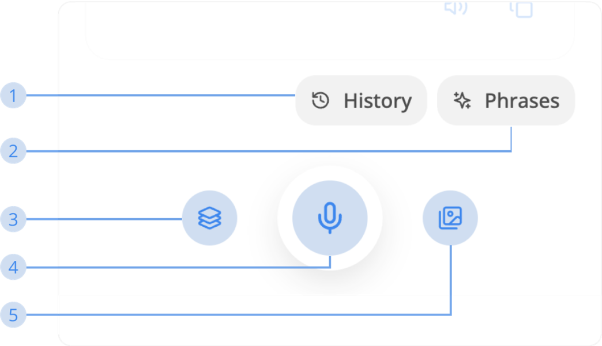

---  
sidebar_position: 3  
hide_table_of_contents: true  
custom_edit_url: null  
pagination_next: null  
pagination_prev: null  
title: Advance features  
---  
  
# How to use Translation  
  
### Advance features  
  
  
  
**1. History**  
Click this button to open the history of your translations  
  
**2. Phrases**  
Phrases contain more than 100 sample sentences for you to use in specific circumstances  
  
**3. Copy all text**  
Click this button to copy: Source text, Target text, and E.S.L translated from source text. This only works when:  
  
- Source & Target languages are not in English  
- E.S.L source and E.S.L target are green  
  
**4. Speech-to-Text**  
Use your voice as the keyboard input.  
*\*Note: This button is not working on Auto Detect Language mode.*  
  
**5. Take screenshot**  
Click this button to quickly take a screenshot of the translation you made to share with anyone. This only works when:  
- Source & Target languages are not in English  
- E.S.L source and E.S.L target are green  
