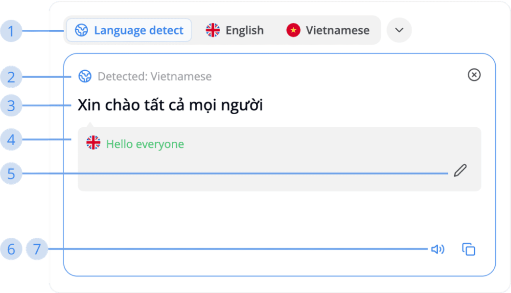

---  
sidebar_position: 1  
hide_table_of_contents: true  
custom_edit_url: null  
pagination_next: null  
pagination_prev: null  
title: Source  
---  
# How to use Translation  
  
### Source  
  
  
  
Source is the left-side text box in Translation page where you can input your text which need to be translated at there  
  
**1. “Select language” bar**  
   It will display the language you have recently selected to help you change the translation language quickly  
  
**2. Source language**  
   The original language of the text you need to translate  
  
**3. Inputted source**  
   The text you need to translate  
  
**4. E.S.L translated from source**  
   The English translated text from your inputted source. Middo uses it to compare with the E.S.L translated from the target in order to give you high accuracy translation. It will be displayed in 2 different colors, each meaning:  
   - **Red**: E.S.L source and E.S.L target are not matched  
   - **Green**: E.S.L source and E.S.L target are matched  
  
**5. Edit E.S.L translation**  
   If the E.S.L translation does not contain the correct meaning from your original text, you can edit it to correct it  
  
**6. Text-to-Speech**  
   Middo will read out loud what you have inputted  
  
**7. Copy text**  
   Copy the text you have inputted  
