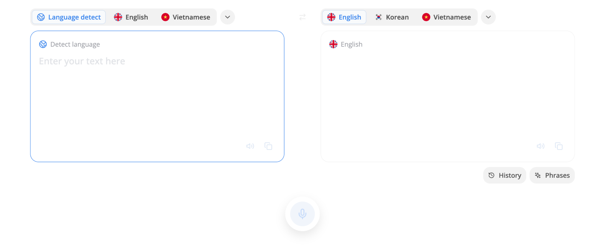

---  
sidebar_position: 1  
hide_table_of_contents: true  
custom_edit_url: null  
pagination_next: null  
pagination_prev: null  
title: What is Translation  
---  
  
  
# What is Translation  
  
  
  
- Middo provides an ESL translation method to guarantee a high-accuracy translate  
- E.S.L stands for English as a Second Language. This is the term used to refer to learning English for people who have another mother tongue  
  
**Middo Translation’s Features**  
  
- Support more than 100 languages  
- Speech-to-text input support  
- More than 100+ example phrases at all situations  
- Save and share your translation so easily  
  
