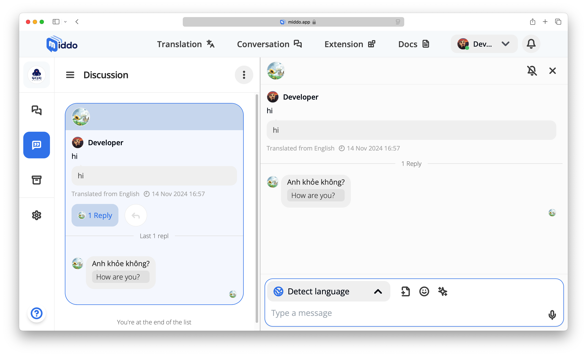

# What's new in the 0.7 Version

### **1. Discussion List**

- **Easily Accessible Discussions**: All active discussions are now neatly organized in the sidebar, making it easier to switch between ongoing conversations.
- **View Participants**: Click on the reply count to see who has participated in a specific Discussion.
- **Quick Reply**: You can now quickly reply to messages directly from the sidebar, without needing to open the full conversation.
- **Toggle Notifications**: Turn notifications on or off for any Discussion directly from the sidebar. If they’re off, simply click to turn them back on.

### **2. Active Status**

- **Color-Coded Indicators**:
  - **Grey**: This user or all users in the group are not currently using Middo.
  - **Green**: This user or all users in the group are actively using Middo.
- **Quick Status Updates**: The active status of users is updated in real-time, so you can easily see who’s available or engaged in a call.

### **3. Improved Organization**

- **Conversation Grouping**: Conversations are grouped based on their activity status, making it easier to prioritize ongoing discussions and archived ones.
- **Clearer Navigation**: The sidebar now features a more intuitive layout, making it faster to find and interact with your discussions, messages, and other settings.
