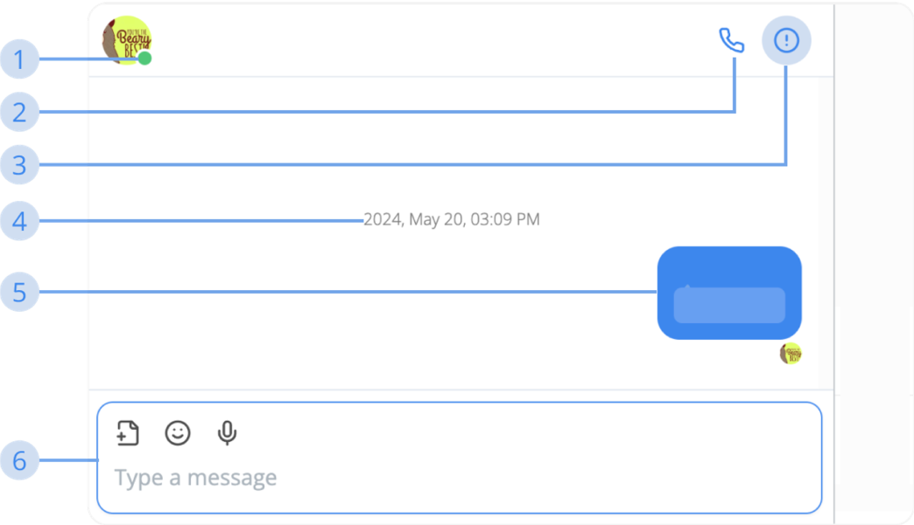

# How to use Conversation

### Message Box  

**1. Online status**
- **Grey:** This user or every users in this group is not using Middo currently
- **Green:** This user or every users in this group is using Middo currently
- **Red:** This user is in a Middo Call

**2. Start Middo Call**  
Click this button to start a call with a person or group.

**3. Show Conversation Information**  
Click this button to show the information of any conversation.

**4. Timestamp**  
Every 10 minutes, a timestamp will be shown to let you know when this conversation section started.

**5. Message Item**  
It contains the message, E.S.L translated message, and other status.

**6. Input Message Box**  
The place where you input your message and other tools.
