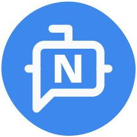
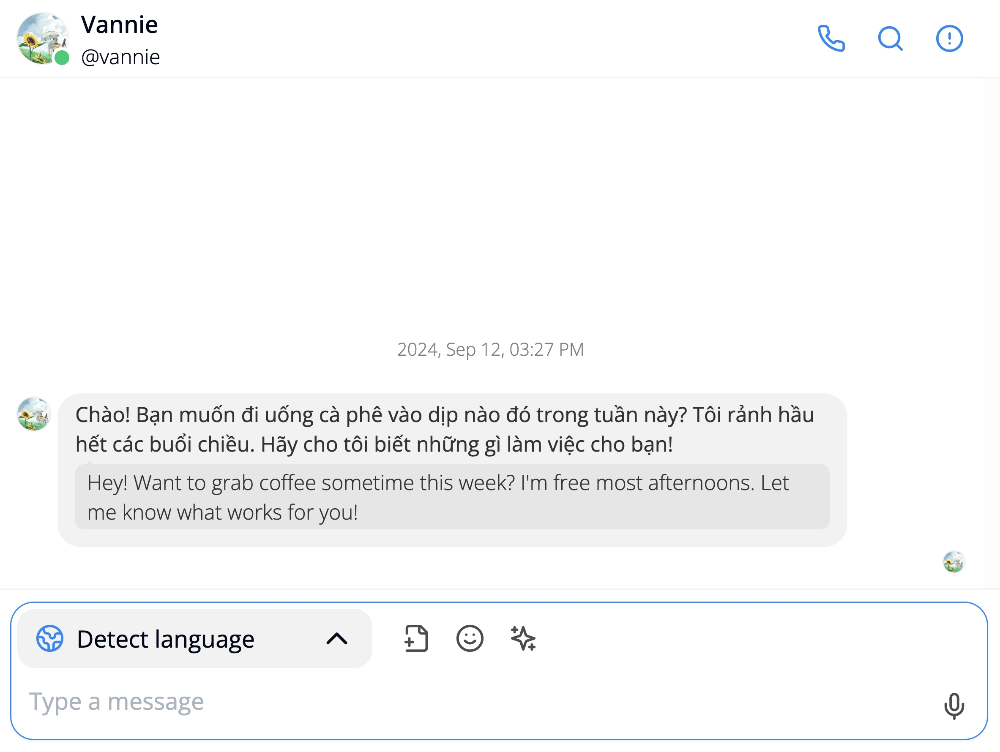
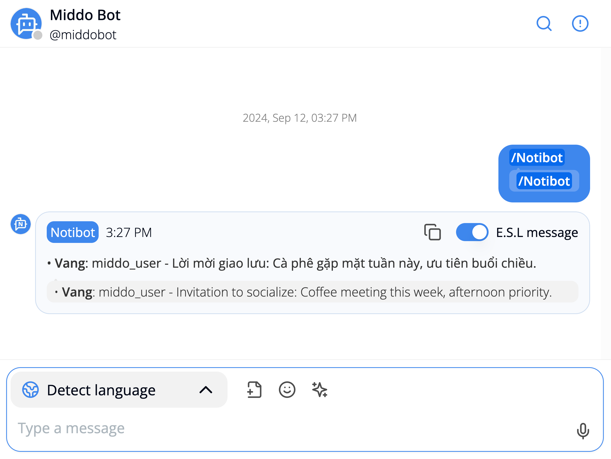

---  
sidebar_position: 4  
hide_table_of_contents: true  
custom_edit_url: null  
pagination_next: null  
pagination_prev: null  
title: Notification Bot  
---  
# Middo Bots
  
  
### **Notibot (Notification Bot)**  
  
  
**Purpose:**  Notibot is designed to send notifications and alerts within your Middo Station.    
**Functionality:**  It can announce important updates, trigger reminders, and provide status updates.  
**Examples:**  
- Announcing new tasks or deadlines.  
- Sending reminders for upcoming meetings.  
- Providing updates on project progress.
  
**How to use?**  
- **Automatically**: This bot will automatically send a DM whenever you have at least **10 unread messages**  
- **Manually**: You can send a DM to ask the bot to summarize whenever you have at least **1 unread message**  

### Example Output

**Explanation:**  
- **User:** The user asks Notibot to summarize their unread messages  
- **Notibot:** Notibot identifies that there is one unread message from Vannie

**Summary:** Notibot summarizes the message by highlighting the key information:
- Vannie's invitation to grab coffee
- Vannie's availability (most afternoons)

This example shows how Notibot can quickly and efficiently provide a concise summary of unread messages, allowing users to stay informed and manage their communication effectively